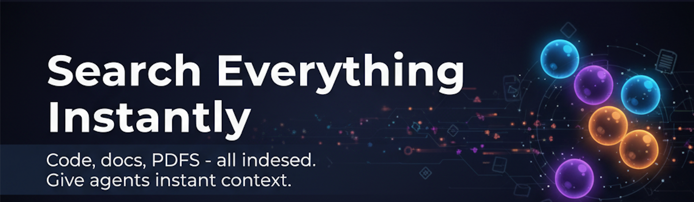
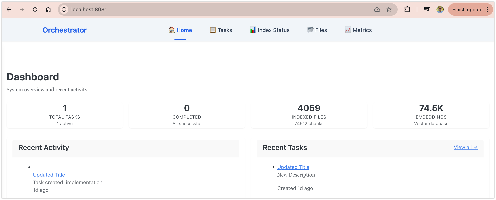

Agent Fusion gives multiple AI coding assistants instant access to your files—code, documents, PDFs, and more—through intelligent indexing, and optionally coordinates their work through a task system.

It has two independent components (each can be used alone or together):

- **Context Engine** – Automatically indexes and searches any folders you configure (code, word documents, PDFs, etc.). Your AI agents can search everything instantly—just ask them to "use query_context" in your prompts. No more copy-pasting code. Deploy with just 2 files: JAR + `fusionagent.toml`. Includes lightweight embedding model; swap for a more powerful model if needed.
- **Task Manager** – Optionally coordinates work between multiple AIs. Routes tasks, enables voting on decisions, and tracks everything in a web dashboard.

🎥 **[Watch the demo](https://youtu.be/kXkTh0fJ0Lc)** to see AI assistants collaborating in action.

---

## How It Works

Agent Fusion fetches up-to-date code examples and documentation right into your LLM's context:

1️⃣ **Write your prompt naturally** – Ask your AI assistant what you'd normally ask

2️⃣ **Tell the LLM to use query_context** – Just add "use query_context to find X" in your prompt

3️⃣ **Get working code answers** – Instant, accurate answers based on your actual codebase

**No tab-switching. No hallucinated APIs that don't exist. No outdated code generation.**

---

## Quick Start

**[Installation Guide](docs/INSTALL.md)** – Step-by-step setup (takes 5-10 minutes)

---

## Context Engine: Intelligent Search & Indexing

The **Context Engine** automatically indexes your files so AI agents can search them instantly:

1. **Watches your folders** – Automatically indexes files you specify (code, documents, PDFs; respects `.gitignore`)
2. **Understands meaning** – Smart search that finds what you're looking for, not just keyword matches
3. **Keeps everything fresh** – Changes detected instantly, always up-to-date
4. **Ready for your agents** – Ask Claude or Codex to "use query_context" in your prompts, and they'll search your indexed files instantly

**How to use it**: Just add to your prompt: *"Use query_context to find [what you're looking for]"* and your AI agent will search your indexed files and give you relevant results. No copy-pasting needed!

### How Search Works

The Context Engine uses **three search types combined**:

- **Semantic Search** – AI-powered understanding of meaning (finds "user authentication" when you search "login system")
- **Full-Text Search** – Fast keyword matching (finds exact phrases and terms)
- **Hybrid Search** – Combines all results ranked by relevance (you get the best matches from all methods)

This means you get accurate results whether you search by meaning or by keywords. The best of both worlds.

The Context Engine is independent—use it alone for smart search, or combine it with the Task Manager. Configured in `fusionagent.toml`, stores everything locally. Configure watch paths and file types to index in the config file.

### Context Engineering

**Context Engineering** is the practice of optimizing how your files are indexed for best results:

- **Watch paths** – Which folders to index (codebase, documents, research, etc.)
- **File types** – Which extensions to include (.kt, .py, .pdf, .docx, etc.)
- **Ignore patterns** – What files to skip (build artifacts, node_modules, etc.)
- **Chunk strategy** – How files are split for understanding (function-level, section-level, paragraph-level)
- **Embedding tuning** – What aspects of content are emphasized in search
- **Refresh strategy** – How often to update the index

Learn more in [Context Engineering Guide](docs/CONTEXT_ENGINEERING.md).

## Task Manager: Coordinate Multiple AIs

The **Task Manager** is completely optional. Use it to coordinate work between multiple AIs:

1. **One AI starts a task** – "Design a new authentication system"
2. **The system routes it** – Simple tasks go to one AI, complex tasks go to multiple
3. **AIs collaborate** – They can see each other's ideas, discuss pros/cons
4. **The group decides** – For important decisions, they vote and you see all viewpoints
5. **Everything is tracked** – All proposals and decisions saved with full reasoning

The Task Manager works best when AIs have access to the Context Engine—they stay coordinated. But you can use Task Manager without Context Engine if you prefer traditional task management.

**Use Task Manager when**:
- You want multiple AIs discussing important decisions
- You need voting/consensus on architectural changes
- You want a complete audit trail of AI reasoning

## Architecture: Two Independent Systems

### Context Engine
Intelligent indexing and search for any files (works standalone):
- **Setup**: Configure folders to watch and file types to index in `fusionagent.toml`
- **Indexing**: Automatically finds and indexes your files, watches for changes
- **Supports**: Code (.kt, .py, .ts, .java), documents (.pdf, .docx, .md), and any file type you configure
- **Search**: Smart search that understands meaning, not just keywords (semantic + symbol + full-text + git history)
- **Local**: Everything stored locally in DuckDB, never sent to cloud
- **Agent Access**: Tell your AI agents "use query_context to find X" and they'll search instantly
- **Standalone**: Works independently without Task Manager—great for teams who just need smart file search

### Task Manager
Workflow coordination for multiple AIs (optional addon):
- Routes tasks intelligently (solo vs consensus)
- Enables collaborative decision-making with AI voting
- Tracks all proposals, votes, and final decisions
- Provides web dashboard with real-time updates
- Can be used standalone for traditional task management

---

## License

MIT
