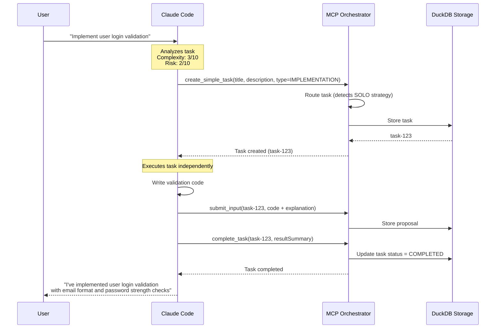
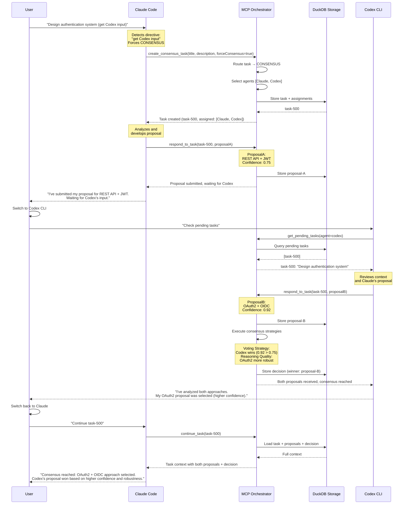
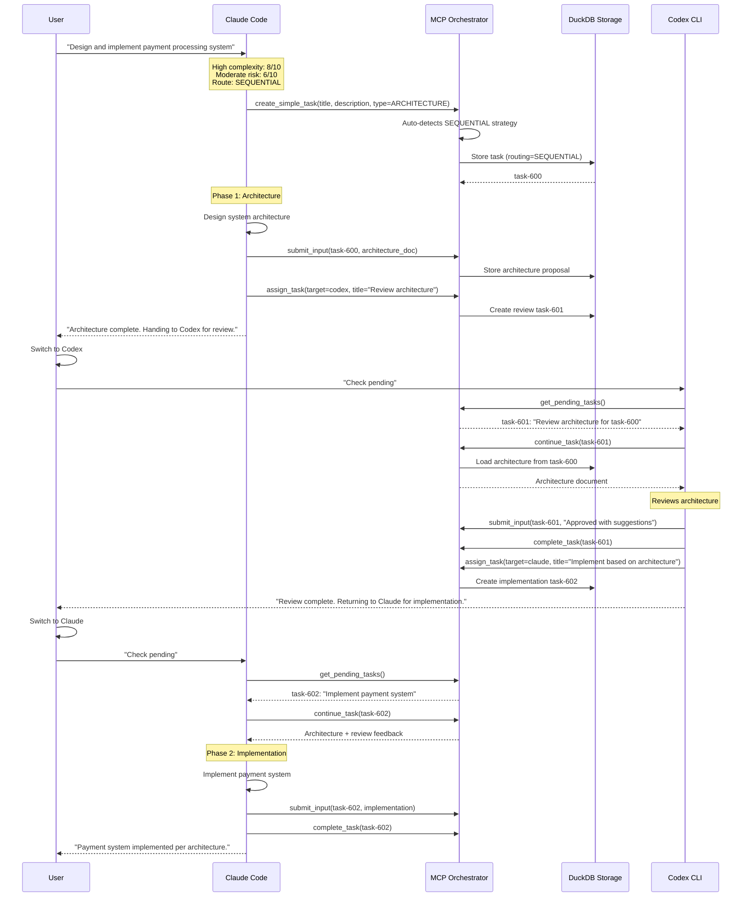
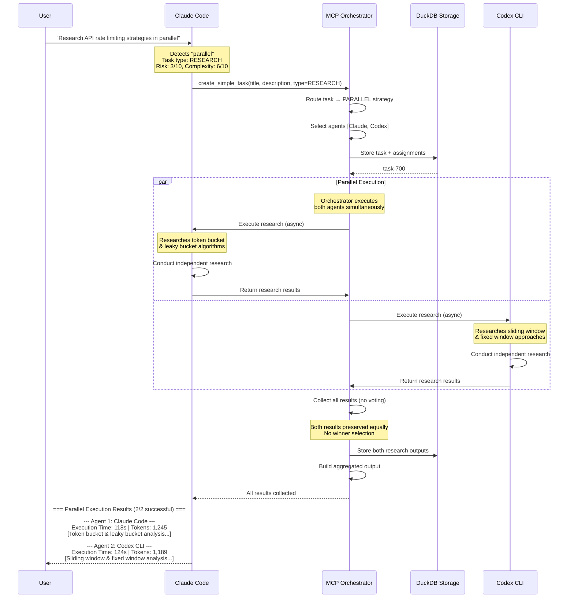
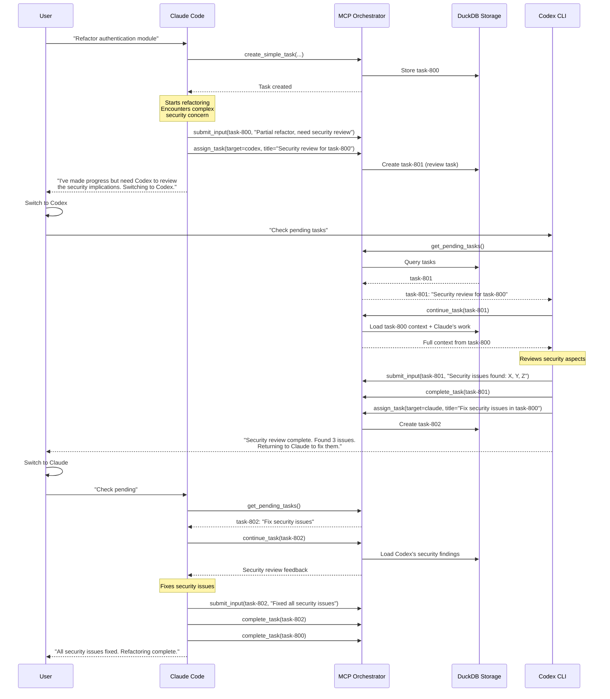

# Agent Fusion - Sequence Diagrams

This document contains sequence diagrams illustrating various workflows in the Agent Fusion orchestration system.

## Table of Contents

1. [Simple Task Flow (SOLO)](#simple-task-flow-solo)
2. [Consensus Task Flow (Multi-Agent)](#consensus-task-flow-multi-agent)
3. [Sequential Task Flow](#sequential-task-flow)
4. [Parallel Task Flow](#parallel-task-flow)
5. [Task Handoff Between Agents](#task-handoff-between-agents)

---

## Simple Task Flow (SOLO)

**Scenario**: User asks Claude Code to implement a simple feature. Low complexity, low risk.

**Key Points:**
- Single agent handles entire workflow
- No consensus or review needed
- Fast execution (< 1 minute typically)
- Used for 70% of tasks

---

## Consensus Task Flow (Multi-Agent)

**Scenario**: User asks for critical architecture decision requiring multiple perspectives.

**Key Points:**
- Multiple agents submit independent proposals
- Orchestrator executes consensus strategies
- Winner selected based on confidence & reasoning quality
- Used for critical decisions (5-10% of tasks)
- Requires user to switch between agents

---

## Sequential Task Flow

**Scenario**: Complex multi-phase task requiring handoffs between agents.

**Key Points:**
- Tasks progress through phases with handoffs
- Each agent completes their phase before handoff
- Context preserved across transitions
- Used for complex projects (10-15% of tasks)

---

## Parallel Task Flow

**Scenario**: Research task requiring diverse perspectives without coordination.

**Key Points:**
- Agents execute simultaneously (not sequentially)
- No coordination between agents during execution
- All results preserved without ranking
- Fast execution (parallel = ~2 min vs sequential = ~4 min)
- Used for research and exploration (5-10% of tasks)

---

## Task Handoff Between Agents

**Scenario**: Agent needs another agent's expertise mid-task.

**Key Points:**
- Agents can request help mid-task
- Full context shared across handoffs
- Asynchronous collaboration supported
- Context preserved in database
- Common pattern for code reviews and expertise needs

---

## Legend

### Participant Types
- **User**: Human developer interacting with agents
- **Claude Code / Codex CLI**: AI agent clients
- **MCP Orchestrator**: Central coordination server
- **DuckDB Storage**: Persistent storage layer

### Task Statuses
- `PENDING`: Task created, waiting for agent
- `IN_PROGRESS`: Agent actively working
- `WAITING_INPUT`: Waiting for another agent's input
- `COMPLETED`: Task finished successfully
- `FAILED`: Task execution failed

### Routing Strategies
- **SOLO**: Single agent (70% of tasks)
- **CONSENSUS**: Multiple agents vote (5-10%)
- **SEQUENTIAL**: Phased handoffs (10-15%)
- **PARALLEL**: Simultaneous execution (5-10%)

---

## Additional Resources

- [Conversation Handoff Workflow](CONVERSATION_HANDOFF_WORKFLOW.md) - Detailed workflow documentation
- [Agent Orchestrator Instructions](AGENT_ORCHESTRATOR_INSTRUCTIONS.md) - Agent configuration guide
- [Orchestrator Workflow Guide](../orchestrator_workflow_guide.md) - Human user perspective

---

**Generated**: 2025-10-11
**Version**: 1.0
