# Web Dashboard Architecture

**Version:** 1.0  
**Status:** Draft  
**Author:** System Architecture Team  
**Last Updated:** 2025-10-18

---

## Table of Contents

1. [Executive Summary](#1-executive-summary)
2. [Goals and Non-Goals](#2-goals-and-non-goals)
3. [System Overview](#3-system-overview)
4. [Technology Stack](#4-technology-stack)
5. [Architecture Components](#5-architecture-components)
6. [Data Flow](#6-data-flow)
7. [Pages and Features](#7-pages-and-features)
8. [HTMX Integration Patterns](#8-htmx-integration-patterns)
9. [Server-Side Rendering Strategy](#9-server-side-rendering-strategy)
10. [SSE Real-Time Updates](#10-sse-real-time-updates)
11. [URL Schema and Routing](#11-url-schema-and-routing)
12. [Browser Auto-Launch](#12-browser-auto-launch)
13. [Database Queries](#13-database-queries)
14. [Performance Targets](#14-performance-targets)
15. [Implementation Phases](#15-implementation-phases)
16. [Security Considerations](#16-security-considerations)
17. [Testing Strategy](#17-testing-strategy)
18. [Monitoring and Observability](#18-monitoring-and-observability)
19. [Future Enhancements](#19-future-enhancements)
20. [Risks and Mitigations](#20-risks-and-mitigations)
21. [Success Metrics](#21-success-metrics)

---

## 1. Executive Summary

### 1.1 Problem Statement

The Agent Fusion Orchestrator currently operates purely through CLI and MCP protocol interactions, making it difficult for users to:

- **Track task flow visually**: Understanding multi-agent workflows and consensus processes
- **Monitor system health**: Index status, file synchronization, and provider health
- **Analyze metrics**: Token usage, performance bottlenecks, and decision quality
- **Debug issues**: Tracing task execution paths and identifying failures
- **Perform admin actions**: Triggering index refreshes, rebuilds, and optimizations

Users must query the database directly or use MCP tools, which is cumbersome and error-prone.

### 1.2 Proposed Solution

Add a **lightweight web dashboard** that provides:

- **Tasks DataTable**: Searchable, filterable table with drill-down to Mermaid flow diagrams
- **Index Status Page**: File browser, provider health, refresh/rebuild controls
- **Metrics Dashboard**: Token usage, performance, decision analytics with charts
- **Real-Time Updates**: SSE-powered live data without page refreshes
- **Server-Side Rendering**: HTMX-driven partial updates, minimal JavaScript
- **Auto-Launch**: Browser opens automatically on server start

### 1.3 Key Design Principles

1. **Server-Driven**: HTML rendered on server, not client yyy
2. **Minimal JavaScript**: Only HTMX (~14KB) and Mermaid.js (~500KB)
3. **Real-Time**: SSE for push updates, no polling
4. **Progressive Enhancement**: Works without JS, better with JS
5. **Zero Build Step**: No npm, webpack, or transpilation
6. **Single Binary**: Web UI bundled with orchestrator
7. **Fast**: Target <100ms server response, <50ms HTMX swaps

---

## 2. Goals and Non-Goals

### 2.1 Goals

**Primary Goals:**
- ✅ **Visual Task Tracking**: DataTable with Mermaid flow diagrams
- ✅ **Index Management UI**: Status monitoring and admin controls
- ✅ **Metrics Visualization**: Charts and dashboards for analytics
- ✅ **Real-Time Updates**: SSE-powered live data
- ✅ **Zero JavaScript Build**: No npm, webpack, or React
- ✅ **Auto-Launch Browser**: Open dashboard on server start
- ✅ **Mobile Responsive**: Works on tablets and phones

**Secondary Goals:**
- ✅ Export functionality (CSV, JSON)
- ✅ Saved filter presets
- ✅ Dark mode support
- ✅ Keyboard shortcuts
- ✅ Accessibility (WCAG 2.1 AA)

### 2.2 Non-Goals

**Out of Scope for v1.0:**
- ❌ User authentication/authorization (single-user system)
- ❌ Multi-tenancy support
- ❌ Real-time collaborative editing
- ❌ Mobile native apps
- ❌ WebSocket bidirectional communication (SSE sufficient)
- ❌ GraphQL API (REST sufficient)
- ❌ Embedded database admin (use DBeaver/DataGrip)
- ❌ Code editor in browser (use IDE)

---

## 3. System Overview

### 3.1 High-Level Architecture

```
┌─────────────────────────────────────────────────────────────┐
│                    Browser (Client)                          │
│  ┌───────────────────────────────────────────────────────┐  │
│  │  HTML + CSS (Server-Rendered)                         │  │
│  │  • Minimal JavaScript (htmx.js + mermaid.js)          │  │
│  │  • No build step, no transpilation                    │  │
│  │  • Progressive enhancement                            │  │
│  └───────────────────────────────────────────────────────┘  │
└────────────┬─────────────────────────────┬──────────────────┘
             │ HTMX Requests               │ SSE Events
             │ (HTML fragments)            │ (Server push)
             ▼                             ▼
┌─────────────────────────────────────────────────────────────┐
│              Ktor Web Server (Port 8081)                     │
│  ┌───────────────────────────────────────────────────────┐  │
│  │  HTML Rendering Layer                                 │  │
│  │  • Kotlinx.html DSL (type-safe)                       │  │
│  │  • Partial rendering for HTMX                         │  │
│  │  • Template fragments                                 │  │
│  └───────────────────────────────────────────────────────┘  │
│  ┌───────────────────────────────────────────────────────┐  │
│  │  HTTP Routes                                          │  │
│  │  • Page routes (full HTML)                            │  │
│  │  • Fragment routes (partial HTML)                     │  │
│  │  • SSE endpoints (event streams)                      │  │
│  │  • API routes (JSON for export)                       │  │
│  └───────────────────────────────────────────────────────┘  │
│  ┌───────────────────────────────────────────────────────┐  │
│  │  SSE Broadcaster                                      │  │
│  │  • Manages active SSE connections                     │  │
│  │  • Broadcasts events to subscribers                   │  │
│  │  • Handles connection lifecycle                       │  │
│  └───────────────────────────────────────────────────────┘  │
│  ┌───────────────────────────────────────────────────────┐  │
│  │  EventBus Subscriber                                  │  │
│  │  • Listens to task/index/metric events               │  │
│  │  • Triggers SSE broadcasts                            │  │
│  │  • Converts domain events to HTML fragments          │  │
│  └───────────────────────────────────────────────────────┘  │
└────────────────────┬────────────────────────────────────────┘
                     │ Data queries
┌────────────────────▼────────────────────────────────────────┐
│              Existing Components                             │
│  ┌───────────────────────────────────────────────────────┐  │
│  │  EventBus (TASK-052)                                  │  │
│  │  • TaskStatusChangedEvent                             │  │
│  │  • IndexProgressEvent                                 │  │
│  │  • MetricsUpdatedEvent                                │  │
│  └───────────────────────────────────────────────────────┘  │
│  ┌───────────────────────────────────────────────────────┐  │
│  │  TaskRepository                                       │  │
│  │  • findAll(filters, pagination, sorting)              │  │
│  │  • findById(taskId)                                   │  │
│  │  • getProposals(taskId)                               │  │
│  └───────────────────────────────────────────────────────┘  │
│  ┌───────────────────────────────────────────────────────┐  │
│  │  ContextModule                                        │  │
│  │  • getIndexStatus()                                   │  │
│  │  • getFileList()                                      │  │
│  │  • refreshIndex()                                     │  │
│  └───────────────────────────────────────────────────────┘  │
│  ┌───────────────────────────────────────────────────────┐  │
│  │  MetricsModule (TASK-061)                             │  │
│  │  • generateSnapshot()                                 │  │
│  │  • getTokenReport()                                   │  │
│  │  • getPerformanceDashboard()                          │  │
│  └───────────────────────────────────────────────────────┘  │
│  ┌───────────────────────────────────────────────────────┐  │
│  │  DuckDB                                               │  │
│  │  • tasks, proposals, decisions                        │  │
│  │  • file_state, chunks, embeddings                     │  │
│  │  • metrics_timeseries                                 │  │
│  └───────────────────────────────────────────────────────┘  │
└─────────────────────────────────────────────────────────────┘
```

### 3.2 Component Separation

```
┌─────────────────────────────────────────────────────────────┐
│  MCP Server (Port 8080)          │  Web Server (Port 8081)  │
├──────────────────────────────────┼──────────────────────────┤
│  • MCP protocol tools            │  • HTTP/HTML endpoints   │
│  • Agent communication           │  • SSE endpoints         │
│  • JSON-RPC messages             │  • Static file serving   │
│  • Programmatic access           │  • Human-friendly UI     │
└──────────────────────────────────┴──────────────────────────┘
           │                                  │
           └──────────┬───────────────────────┘
                      │
              ┌───────▼────────┐
              │  Shared Core   │
              │  • EventBus    │
              │  • Repositories│
              │  • Domain      │
              └────────────────┘
```

**Rationale for Separate Ports:**
- **Isolation**: MCP and Web traffic don't interfere
- **Security**: Different auth/CORS policies if needed
- **Scalability**: Can scale independently (future)
- **Clarity**: Clear separation of concerns

---

## 4. Technology Stack

### 4.1 Backend Technologies

| Component | Technology | Version | Rationale |
|-----------|-----------|---------|-----------|
| **Web Framework** | Ktor | 2.3.7+ | Already in use, mature, Kotlin-native |
| **HTMX Plugin** | ktor-server-htmx | 2.3.7+ | Official Ktor HTMX integration |
| **HTML DSL** | kotlinx.html | Latest | Type-safe HTML generation, no templates |
| **SSE** | Ktor SSE Plugin | 2.3.7+ | Built-in SSE support, coroutine-based |
| **Serialization** | kotlinx.serialization | 1.6.0+ | Already in use, JSON for API endpoints |
| **Database** | DuckDB | 0.10.0+ | Already in use, no changes |
| **Logging** | SLF4J + Logback | Standard | Already in use |

### 4.2 Frontend Technologies

| Component | Technology | Size | Distribution | Rationale |
|-----------|-----------|------|--------------|-----------|
| **HTMX** | htmx.org | ~14KB | Bundled in JAR | Declarative AJAX, SSE, no build step |
| **Mermaid.js** | mermaid | ~500KB | Bundled in JAR | Diagram rendering, well-maintained |
| **CSS** | Vanilla CSS | N/A | Bundled in JAR | Simple, no framework needed |
| **Icons** | SVG inline | N/A | Bundled in JAR | No external dependencies |

**Distribution Strategy:**
- All static assets (HTML, CSS, JS) bundled in single JAR file
- No external dependencies at runtime (except JDK 21+)
- No CDN dependencies - fully offline capable
- Resources served from classpath via Ktor static file routing

**No JavaScript Framework:**
- ❌ No React, Vue, Angular, Svelte
- ❌ No npm, webpack, Vite, Rollup
- ❌ No TypeScript compilation
- ❌ No build step at all

**Why Ktor HTMX Plugin?**
- ✅ **Official Integration**: `implementation("io.ktor:ktor-server-htmx:2.3.7")`
- ✅ **Type-Safe Builders**: Kotlin DSL for HTMX attributes
- ✅ **Response Helpers**: Built-in HX response header management
- ✅ **Redirect Support**: HTMX-specific redirect handling
- ✅ **Request Detection**: `call.request.isHtmx()` helper
- ✅ **Seamless Integration**: Works with kotlinx.html DSL

**Single JAR Distribution:**
- ✅ **Zero External Files**: Everything bundled in one JAR
- ✅ **Embedded Resources**: HTML, CSS, JS, ONNX model all included
- ✅ **Simple Deployment**: Just `java -jar orchestrator.jar`
- ✅ **No Build Step**: No npm, webpack, or frontend tooling
- ✅ **Offline Capable**: No CDN dependencies, works without internet
- ✅ **Version Locked**: Guaranteed compatibility of all assets

**Gradle Configuration:**
```kotlin
dependencies {
    // Ktor HTMX plugin
    implementation("io.ktor:ktor-server-htmx:2.3.7")
    
    // HTML DSL
    implementation("io.ktor:ktor-server-html-builder:2.3.7")
    
    // SSE support
    implementation("io.ktor:ktor-server-sse:2.3.7")
    
    // Shadow plugin for fat JAR
    id("com.github.johnrengelman.shadow") version "8.1.1"
}
```

**Resource Structure:**
```
src/main/resources/
├── static/
│   ├── js/
│   │   ├── htmx.min.js           # 14KB bundled
│   │   └── mermaid.min.js        # 500KB bundled
│   ├── css/
│   │   ├── dashboard.css
│   │   └── dark-mode.css
│   └── images/
│       └── logo.svg
└── models/
    └── all-MiniLM-L6-v2.onnx    # 86MB ONNX model
```

**Distribution Commands:**
```bash
# Build single fat JAR (includes everything)
./gradlew shadowJar

# Output: build/libs/orchestrator-all.jar (~150MB)
# Includes: app code + dependencies + HTMX + Mermaid + ONNX model

# Run anywhere with just JDK 21+
java -jar orchestrator-all.jar

# That's it - no config files, no npm install, no setup!
```

### 4.3 Development Tools

| Tool | Purpose | Required? |
|------|---------|-----------|
| **IntelliJ IDEA** | Kotlin IDE | Yes |
| **Browser DevTools** | Debugging | Yes |
| **DBeaver** | Database admin | Optional |
| **curl/httpie** | API testing | Optional |

**No Node.js, npm, or JavaScript tooling required.**

---

## 5. Architecture Components

### 5.1 Component Diagram

```
┌─────────────────────────────────────────────────────────────┐
│                    WebServerModule                           │
│  • Ktor application setup                                   │
│  • Plugin installation (SSE, CORS, ContentNegotiation)      │
│  • Route registration                                       │
│  • Static file serving                                      │
│  • Lifecycle management (start/stop)                        │
└────────────────────┬────────────────────────────────────────┘
                     │
         ┌───────────┴───────────┬───────────────┬────────────┐
         │                       │               │            │
┌────────▼────────┐   ┌─────────▼──────┐  ┌────▼─────┐  ┌──▼─────┐
│   Routes        │   │   Renderers    │  │   SSE    │  │ Utils  │
│                 │   │                │  │          │  │        │
│ • TaskRoutes    │   │ • TaskRenderer │  │ • SSE    │  │ • Date │
│ • IndexRoutes   │   │ • IndexRenderer│  │   Broad- │  │   fmt  │
│ • MetricsRoutes │   │ • MetricsRend. │  │   caster │  │ • HTML │
│ • AdminRoutes   │   │ • Mermaid      │  │ • Event  │  │   esc  │
│                 │   │   Generator    │  │   Sub-   │  │ • CSV  │
│                 │   │ • ChartRenderer│  │   scriber│  │   exp  │
└─────────────────┘   └────────────────┘  └──────────┘  └────────┘
```

### 5.2 Component Responsibilities

#### **WebServerModule**
- **Purpose**: Main entry point for web server
- **Responsibilities**:
  - Initialize Ktor application
  - Install plugins (SSE, CORS, logging, etc.)
  - Register all routes
  - Serve static files (CSS, JS)
  - Manage server lifecycle
  - Subscribe to EventBus
  - Coordinate SSE broadcasting
- **Dependencies**: Config, EventBus, Repositories

#### **Routes**
- **Purpose**: Handle HTTP requests and return responses
- **Responsibilities**:
  - Parse query parameters
  - Validate input
  - Call repositories/modules for data
  - Invoke renderers to generate HTML
  - Return appropriate HTTP responses
  - Handle errors gracefully
- **Types**:
  - **Page Routes**: Full HTML pages (e.g., `/tasks`)
  - **Fragment Routes**: Partial HTML (e.g., `/tasks/table`)
  - **SSE Routes**: Event streams (e.g., `/sse/tasks`)
  - **API Routes**: JSON responses (e.g., `/api/tasks/export`)

#### **Renderers**
- **Purpose**: Generate HTML from domain data
- **Responsibilities**:
  - Use kotlinx.html DSL to build HTML
  - Apply consistent styling
  - Generate HTMX attributes
  - Format dates, numbers, etc.
  - Create visualizations (Mermaid, charts)
  - Ensure accessibility (ARIA labels)
- **Types**:
  - **Page Renderers**: Full HTML documents
  - **Fragment Renderers**: Partial HTML
  - **Component Renderers**: Reusable UI elements

#### **SseBroadcaster**
- **Purpose**: Manage SSE connections and broadcasting
- **Responsibilities**:
  - Track active SSE sessions
  - Broadcast events to all/specific clients
  - Handle connection lifecycle
  - Implement reconnection logic
  - Filter events by topic/channel
- **Thread Safety**: ConcurrentHashMap for session storage

#### **EventBusSubscriber**
- **Purpose**: Bridge between EventBus and SSE
- **Responsibilities**:
  - Subscribe to domain events
  - Convert events to HTML fragments
  - Trigger SSE broadcasts
  - Route events to appropriate channels
- **Event Types**:
  - `TaskStatusChangedEvent` → task row HTML
  - `IndexProgressEvent` → progress bar HTML
  - `MetricsUpdatedEvent` → metrics widget HTML

---

## 6. Data Flow

### 6.1 Initial Page Load

```
User                Browser              WebServer            Repository
 │                     │                     │                     │
 │  Navigate to /tasks │                     │                     │
 ├────────────────────>│                     │                     │
 │                     │  GET /tasks         │                     │
 │                     ├────────────────────>│                     │
 │                     │                     │  findAll(filters)   │
 │                     │                     ├────────────────────>│
 │                     │                     │  List<Task>         │
 │                     │                     │<────────────────────┤
 │                     │                     │ renderTasksPage()   │
 │                     │                     │ (generate HTML)     │
 │                     │  Full HTML page     │                     │
 │                     │<────────────────────┤                     │
 │  Display page       │                     │                     │
 │<────────────────────┤                     │                     │
 │                     │                     │                     │
 │                     │  HTMX: hx-trigger="load"                  │
 │                     │  GET /tasks/table   │                     │
 │                     ├────────────────────>│                     │
 │                     │  HTML fragment      │                     │
 │                     │<────────────────────┤                     │
 │  Display table      │ (swap into #tasks-table)                 │
 │<────────────────────┤                     │                     │
```

### 6.2 HTMX Partial Update (Filter Change)

```
User                Browser              WebServer            Repository
 │                     │                     │                     │
 │  Change filter      │                     │                     │
 ├────────────────────>│                     │                     │
 │                     │  HTMX: hx-trigger="change"                │
 │                     │  GET /tasks/table?status=PENDING          │
 │                     ├────────────────────>│                     │
 │                     │                     │  findAll(filters)   │
 │                     │                     ├────────────────────>│
 │                     │                     │  List<Task>         │
 │                     │                     │<────────────────────┤
 │                     │                     │ renderTableFragment()│
 │                     │  HTML fragment      │                     │
 │                     │<────────────────────┤                     │
 │  Swap table content │ (innerHTML)         │                     │
 │<────────────────────┤                     │                     │
```

### 6.3 SSE Real-Time Update

```
EventBus            EventSubscriber      SseBroadcaster      Browser
   │                     │                     │                │
   │ TaskStatusChanged   │                     │                │
   ├────────────────────>│                     │                │
   │                     │  renderTaskRow()    │                │
   │                     │  (HTML fragment)    │                │
   │                     │                     │                │
   │                     │  broadcast(event)   │                │
   │                     ├────────────────────>│                │
   │                     │                     │  SSE: event=   │
   │                     │                     │  taskUpdated   │
   │                     │                     ├───────────────>│
   │                     │                     │                │ HTMX
   │                     │                     │                │ finds
   │                     │                     │                │ #task-row-123
   │                     │                     │                │ and swaps
```

### 6.4 Form Submission (Refresh Index)

```
User                Browser              WebServer            ContextModule
 │                     │                     │                     │
 │  Click "Refresh"    │                     │                     │
 ├────────────────────>│                     │                     │
 │                     │  HTMX: hx-post="/index/refresh"           │
 │                     │  hx-indicator="#spinner"                  │
 │                     ├────────────────────>│                     │
 │                     │ (spinner shows)     │  refreshIndex()     │
 │                     │                     ├────────────────────>│
 │                     │                     │  (async operation)  │
 │                     │                     │                     │
 │                     │  202 Accepted       │                     │
 │                     │  + progress HTML    │                     │
 │                     │<────────────────────┤                     │
 │  Show progress      │                     │                     │
 │<────────────────────┤                     │  EventBus:          │
 │                     │                     │  IndexProgress      │
 │                     │                     │<────────────────────┤
 │                     │  SSE: progress bar  │                     │
 │                     │  updates            │                     │
 │                     │<────────────────────┤                     │
 │  Update progress    │                     │                     │
 │<────────────────────┤                     │                     │
```

---

## 7. Pages and Features

### 7.1 Dashboard Page (Landing)

**URL:** `/dashboard` or `/`

**Purpose:** Overview and navigation hub

**Features:**
- System status summary (uptime, task count, agent status)
- Quick stats (active tasks, token usage today, index health)
- Recent activity feed (last 10 tasks/events)
- Navigation cards to main sections
- System alerts/notifications

**Layout:**
```
┌─────────────────────────────────────────────────────────────┐
│  Agent Fusion Orchestrator                       [Settings] │
├─────────────────────────────────────────────────────────────┤
│                                                              │
│  ┌──────────────┐  ┌──────────────┐  ┌──────────────┐     │
│  │ Active Tasks │  │ Token Usage  │  │ Index Status │     │
│  │     42       │  │   125.4K     │  │   ✓ Healthy  │     │
│  └──────────────┘  └──────────────┘  └──────────────┘     │
│                                                              │
│  ┌────────────────────────────────────────────────────┐    │
│  │ Recent Activity                                    │    │
│  │ • Task-123: Completed (Claude + Codex consensus)   │    │
│  │ • Index: Refreshed 234 files                       │    │
│  │ • Task-122: In Progress (Claude solo)              │    │
│  └────────────────────────────────────────────────────┘    │
│                                                              │
│  ┌─────────┐  ┌─────────┐  ┌─────────┐  ┌─────────┐      │
│  │ Tasks   │  │ Index   │  │ Metrics │  │ Admin   │      │
│  │ Manager │  │ Status  │  │ Dash    │  │ Tools   │      │
│  └─────────┘  └─────────┘  └─────────┘  └─────────┘      │
└─────────────────────────────────────────────────────────────┘
```

### 7.2 Tasks Page

**URL:** `/tasks`

**Purpose:** Primary task management interface

#### 7.2.1 DataTable Features

**Core Capabilities:**
- ✅ **Server-Side Pagination**: 50 tasks per page by default
- ✅ **Multi-Column Sorting**: Click headers to sort
- ✅ **Advanced Filtering**: 
  - Global search (title, description, ID)
  - Status dropdown (multi-select)
  - Type dropdown
  - Routing strategy dropdown
  - Agent multi-select
  - Risk/complexity range sliders
  - Date range pickers
- ✅ **Saved Filters**: Presets like "Active Tasks", "High Risk", "Overdue"
- ✅ **Export**: CSV, JSON with applied filters
- ✅ **Bulk Actions**: (future) Select multiple, bulk status change

**Columns:**

| Column | Sortable | Filterable | Width | Renderer |
|--------|----------|------------|-------|----------|
| ID | ✓ | ✓ (search) | 100px | Plain text |
| Title | ✓ | ✓ (search) | 250px | Truncated + tooltip |
| Type | ✓ | ✓ (dropdown) | 120px | Badge |
| Status | ✓ | ✓ (dropdown) | 120px | Colored badge |
| Strategy | ✓ | ✓ (dropdown) | 120px | Plain text |
| Agents | ✗ | ✓ (multi) | 150px | Agent badges |
| Complexity | ✓ | ✓ (range) | 100px | Progress bar |
| Risk | ✓ | ✓ (range) | 80px | Color indicator |
| Created | ✓ | ✓ (range) | 120px | Relative time |
| Actions | ✗ | ✗ | 100px | View/Edit buttons |

**Filter Panel Layout:**
```
┌─────────────────────────────────────────────────────────────┐
│ Filters                                    [Reset] [Export]  │
├─────────────────────────────────────────────────────────────┤
│ [Search: _______________]  [Status ▼] [Type ▼] [Strategy ▼] │
│                                                               │
│ Agents: [Claude] [Codex] [Gemini]  Risk: [1 ━━━━━━━ 10]    │
│                                                               │
│ Date: [Last 30 days ▼]  Complexity: [1 ━━━━━━━ 10]          │
│                                                               │
│ Presets: [Active] [High Risk] [Consensus] [Overdue]         │
└─────────────────────────────────────────────────────────────┘
```

#### 7.2.2 Task Detail Modal

**Trigger:** Click any table row

**Layout:**
```
┌─────────────────────────────────────────────────────────────┐
│ Task: TASK-123 - Fix authentication bug              [✕]    │
├─────────────────────────────────────────────────────────────┤
│                                                              │
│ [Overview] [Flow] [Proposals] [Conversation] [History]      │
│                                                              │
│ ┌─ Overview ──────────────────────────────────────────┐     │
│ │ Type: IMPLEMENTATION    Status: COMPLETED           │     │
│ │ Strategy: CONSENSUS     Risk: 7  Complexity: 8      │     │
│ │ Agents: Claude, Codex                               │     │
│ │ Created: 2025-10-18 10:30                           │     │
│ │                                                      │     │
│ │ Description:                                         │     │
│ │ Fix OAuth 2.0 timeout issue causing users to be     │     │
│ │ logged out prematurely. Affects ~500 users/day.     │     │
│ └──────────────────────────────────────────────────────┘     │
│                                                              │
│ ┌─ Task Flow (Mermaid) ───────────────────────────────┐     │
│ │                                                      │     │
│ │    graph TD                                          │     │
│ │      A[Task Created] --> B{Routing}                 │     │
│ │      B -->|CONSENSUS| C[Claude]                     │     │
│ │      B -->|CONSENSUS| D[Codex]                      │     │
│ │      C --> E[Proposal 1]                            │     │
│ │      D --> F[Proposal 2]                            │     │
│ │      E --> G[Vote]                                  │     │
│ │      F --> G                                         │     │
│ │      G --> H[Completed ✓]                           │     │
│ │                                                      │     │
│ └──────────────────────────────────────────────────────┘     │
│                                                              │
│ ┌─ Proposals (2) ─────────────────────────────────────┐     │
│ │ ┌─ Proposal 1 (Claude) ──────────────────────────┐  │     │
│ │ │ Confidence: 0.85    Tokens: 450 in / 800 out  │  │     │
│ │ │ Fix: Update session timeout from 30m to 2h    │  │     │
│ │ │ + Add keep-alive ping every 15m               │  │     │
│ │ └────────────────────────────────────────────────┘  │     │
│ │ ┌─ Proposal 2 (Codex) ───────────────────────────┐  │     │
│ │ │ Confidence: 0.78    Tokens: 420 in / 750 out  │  │     │
│ │ │ Fix: Refactor auth module to use JWT refresh  │  │     │
│ │ │ tokens with sliding expiration                │  │     │
│ │ └────────────────────────────────────────────────┘  │     │
│ └──────────────────────────────────────────────────────┘     │
│                                                              │
│ ┌─ Decision ──────────────────────────────────────────┐     │
│ │ Winner: Proposal 1 (Claude)                         │     │
│ │ Strategy: VOTING (2 agents)                         │     │
│ │ Consensus: YES (100% agreement)                     │     │
│ │ Token Usage: 1,250 (saved 420 vs solo)             │     │
│ │                                                      │     │
│ │ Reasoning: Simpler implementation, less risky,      │     │
│ │ faster to deploy. JWT refactor deferred to future.  │     │
│ └──────────────────────────────────────────────────────┘     │
└─────────────────────────────────────────────────────────────┘
```

#### 7.2.3 Mermaid Flow Generation

**Strategy-Specific Diagrams:**

**SOLO:**

```mermaid
graph TD
    A[Task Created] --> B[Agent: Claude]
    B --> C[Completed ✓]
```


**CONSENSUS:**

```mermaid
graph TD
    A[Task Created] --> B{Routing: CONSENSUS}
    B -->|Agent 1| C[Claude]
    B -->|Agent 2| D[Codex]
    C --> E[Proposal 1<br/>Conf: 0.85]
    D --> F[Proposal 2<br/>Conf: 0.78]
    E --> G[Consensus Vote]
    F --> G
    G --> H[Decision: Proposal 1]
    H --> I[Completed ✓]
    
    classDef completed fill:#d4edda,stroke:#28a745
    class I completed
```


**SEQUENTIAL:**

```mermaid
graph TD
    A[Task Created] --> B{Routing: SEQUENTIAL}
    B --> C[Phase 1: Claude<br/>Planning]
    C --> D[Phase 2: Codex<br/>Implementation]
    D --> E[Phase 3: Claude<br/>Review]
    E --> F[Completed ✓]
```


**PARALLEL:**

```mermaid
graph TD
    A[Task Created] --> B{Routing: PARALLEL}
    B -->|Part 1| C[Claude]
    B -->|Part 2| D[Codex]
    B -->|Part 3| E[Gemini]
    C --> F[Merge Results]
    D --> F
    E --> F
    F --> G[Completed ✓]
```


**Status-Based Styling:**
```javascript
// Mermaid class definitions
classDef completed fill:#d4edda,stroke:#28a745,stroke-width:2px
classDef inProgress fill:#fff3cd,stroke:#ffc107,stroke-width:2px
classDef failed fill:#f8d7da,stroke:#dc3545,stroke-width:2px
classDef pending fill:#e7f3ff,stroke:#0d6efd,stroke-width:2px
```

### 7.3 Index Status Page

**URL:** `/index/status`

**Purpose:** Monitor and manage context indexing system

**Features:**
- Overview dashboard (files indexed, chunks, last refresh)
- File browser with search/filter
- Provider health status
- Refresh/rebuild controls
- Progress tracking (SSE-powered)

**Layout:**
```
┌─────────────────────────────────────────────────────────────┐
│  Context Index Status                       Last: 2 min ago  │
├─────────────────────────────────────────────────────────────┤
│                                                              │
│  ┌──────────────┐  ┌──────────────┐  ┌──────────────┐     │
│  │ Files        │  │ Chunks       │  │ Providers    │     │
│  │  1,234       │  │   45,678     │  │   3/3 ✓      │     │
│  └──────────────┘  └──────────────┘  └──────────────┘     │
│                                                              │
│  [🔄 Refresh Index]  [🔨 Rebuild Index]  [⚙️  Optimize DB] │
│                                                              │
│  ┌─ Provider Status ───────────────────────────────────┐    │
│  │ ✓ Semantic Search    45,678 vectors    Healthy     │    │
│  │ ✓ Symbol Search       8,234 symbols    Healthy     │    │
│  │ ✓ Full-Text Search   45,678 chunks     Healthy     │    │
│  └──────────────────────────────────────────────────────┘    │
│                                                              │
│  ┌─ File Browser ──────────────────────────────────────┐    │
│  │ [Search: ___________]  [Filter: All ▼]  [Sort: Name] │   │
│  │                                                       │   │
│  │ 📁 src/                                               │   │
│  │   📁 main/                                            │   │
│  │     📁 kotlin/                                        │   │
│  │       📄 Main.kt              ✓  234 chunks  10ms    │   │
│  │       📄 Config.kt            ✓  123 chunks   5ms    │   │
│  │       📁 modules/                                     │   │
│  │         📄 TaskModule.kt      ✓  456 chunks  15ms    │   │
│  │         📄 ContextModule.kt   ⏳ Indexing...         │   │
│  │                                                       │   │
│  │ [1-50 of 1,234]  [< Prev] [Next >]                   │   │
│  └───────────────────────────────────────────────────────┘   │
└─────────────────────────────────────────────────────────────┘
```

**File States:**
- ✓ **Indexed**: Up to date
- ⏳ **Indexing**: In progress
- ⚠️  **Outdated**: Modified since last index
- ❌ **Error**: Failed to index
- ⊘ **Ignored**: Excluded by config

**Refresh Progress (SSE):**
```
┌─────────────────────────────────────────────────────────────┐
│  Refreshing Index...                              [Cancel]   │
├─────────────────────────────────────────────────────────────┤
│  Progress: [████████████──────────────] 60%                 │
│  Files processed: 742 / 1,234                                │
│  Chunks created: 28,456                                      │
│  Time elapsed: 00:02:34                                      │
│  Estimated remaining: 00:01:42                               │
│                                                              │
│  Currently indexing: src/modules/consensus/Voting.kt         │
└─────────────────────────────────────────────────────────────┘
```

### 7.4 Metrics Dashboard

**URL:** `/metrics`

**Purpose:** Visualize system performance and analytics

**Sections:**

#### 7.4.1 Token Usage
- Line chart: Tokens over time (last 7/30 days)
- Bar chart: Tokens by agent
- Pie chart: Token distribution by task type
- Table: Top 10 tasks by token usage
- Stats: Total tokens, avg per task, savings from consensus

#### 7.4.2 Performance
- Line chart: Task completion time over time
- Bar chart: Avg completion time by strategy
- Gauge: Success rate (last 24h)
- Table: Slowest operations (bottlenecks)
- Heatmap: Task activity by hour/day

#### 7.4.3 Decision Analytics
- Gauge: Routing accuracy
- Bar chart: Strategy effectiveness (success rates)
- Line chart: Confidence calibration
- Table: Common decision patterns
- Network graph: Agent collaboration patterns

**Layout:**
```
┌─────────────────────────────────────────────────────────────┐
│  Metrics Dashboard                     [Last 7 days ▼]      │
├─────────────────────────────────────────────────────────────┤
│                                                              │
│  ┌──────────────┐  ┌──────────────┐  ┌──────────────┐     │
│  │ Total Tokens │  │ Avg/Task     │  │ Savings      │     │
│  │  125.4K      │  │   2,854      │  │   12.3K      │     │
│  └──────────────┘  └──────────────┘  └──────────────┘     │
│                                                              │
│  [Token Usage] [Performance] [Decisions] [Alerts]           │
│                                                              │
│  ┌─ Token Usage ───────────────────────────────────────┐    │
│  │  ┌─────────────────────────────────────────────┐   │    │
│  │  │ 15K │                            /\           │   │    │
│  │  │     │                        /\/    \         │   │    │
│  │  │ 10K │                    /\/          \/\     │   │    │
│  │  │     │                /\/                  \   │   │    │
│  │  │  5K │            /\/                        \ │   │    │
│  │  │     │        /\/                            \│   │    │
│  │  │  0K │───────────────────────────────────────│   │    │
│  │  │     Mon  Tue  Wed  Thu  Fri  Sat  Sun       │   │    │
│  │  └─────────────────────────────────────────────┘   │    │
│  │                                                     │    │
│  │  By Agent:                                          │    │
│  │  Claude: 65,000 (52%)  ████████████████████        │    │
│  │  Codex:  45,000 (36%)  █████████████               │    │
│  │  Gemini: 15,400 (12%)  ████                        │    │
│  └─────────────────────────────────────────────────────┘    │
└─────────────────────────────────────────────────────────────┘
```

**Chart Technologies:**
- **Option 1**: Mermaid.js (already included, supports basic charts)
- **Option 2**: Chart.js via CDN (mature, well-documented)
- **Option 3**: D3.js via CDN (powerful, more complex)
- **Recommendation**: Chart.js for simplicity, D3.js for advanced needs

---

## 8. HTMX Integration Patterns

### 8.1 Core HTMX Attributes

```html
<!-- Basic GET request -->
<div hx-get="/tasks/table" hx-target="#table-container">
    Load tasks
</div>

<!-- POST with form data -->
<form hx-post="/index/refresh" hx-target="#status">
    <button type="submit">Refresh</button>
</form>

<!-- Trigger on events -->
<input type="search" 
       hx-get="/tasks/search" 
       hx-trigger="keyup changed delay:500ms"
       hx-target="#results">

<!-- Swap strategies -->
<div hx-get="/tasks/row/123" 
     hx-swap="outerHTML">  <!-- Replace entire element -->
</div>

<div hx-get="/notification" 
     hx-swap="beforeend">  <!-- Append to end -->
</div>

<!-- Loading indicators -->
<button hx-post="/index/rebuild" 
        hx-indicator="#spinner">
    Rebuild
</button>
<div id="spinner" class="htmx-indicator">Loading...</div>

<!-- Confirmation -->
<button hx-delete="/tasks/123" 
        hx-confirm="Are you sure?">
    Delete
</button>
```

### 8.2 SSE Integration

```html
<!-- Connect to SSE endpoint -->
<div hx-ext="sse" 
     sse-connect="/sse/tasks" 
     sse-swap="taskUpdated">
    <!-- Event "taskUpdated" will swap content here -->
</div>

<!-- Multiple event handlers -->
<div hx-ext="sse" 
     sse-connect="/sse/updates">
    <div sse-swap="taskUpdated" hx-swap="outerHTML"></div>
    <div sse-swap="metricUpdated" hx-swap="innerHTML"></div>
</div>
```

**SSE Event Format:**
```
event: taskUpdated
id: TASK-123
data: <tr id="task-row-TASK-123">...</tr>

```

HTMX behavior:
1. Receives event with id `TASK-123`
2. Finds element `#task-row-TASK-123` in DOM
3. Swaps it with new HTML from `data` field

### 8.3 URL Management and History

```html
<!-- Update URL on swap -->
<a hx-get="/tasks?status=ACTIVE" 
   hx-push-url="true"
   hx-target="#content">
    Active Tasks
</a>

<!-- Preserve scroll position -->
<div hx-get="/tasks/table?page=2" 
     hx-swap="innerHTML"
     hx-preserve-scroll="true">
</div>

<!-- Boost standard links (progressive enhancement) -->
<body hx-boost="true">
    <!-- All links become AJAX automatically -->
    <a href="/tasks">Tasks</a>
</body>
```

### 8.4 Form Handling

```html
<!-- Standard form submission via HTMX -->
<form hx-post="/tasks/create" 
      hx-target="#task-list"
      hx-swap="afterbegin">
    <input type="text" name="title" required>
    <select name="type">
        <option value="IMPLEMENTATION">Implementation</option>
    </select>
    <button type="submit">Create Task</button>
</form>

<!-- File upload -->
<form hx-post="/index/upload" 
      hx-encoding="multipart/form-data"
      hx-target="#result">
    <input type="file" name="file">
    <button type="submit">Upload</button>
</form>

<!-- Validation errors -->
<!-- Server returns 422 with errors fragment -->
<form hx-post="/tasks/create" 
      hx-target="#errors">
    <!-- Fields -->
</form>
<div id="errors">
    <!-- Error messages appear here -->
</div>
```

### 8.5 Polling and Intervals

```html
<!-- Poll for updates every 5 seconds -->
<div hx-get="/tasks/summary" 
     hx-trigger="every 5s"
     hx-target="#summary">
</div>

<!-- Poll only when visible -->
<div hx-get="/metrics/live" 
     hx-trigger="every 10s[document.visibilityState === 'visible']"
     hx-target="#live-metrics">
</div>
```

### 8.6 Out-of-Band Swaps (OOB)

**Use Case:** Update multiple parts of page from single response

**Server Response:**
```html
<!-- Main content -->
<div id="task-list">
    <div>Task 1</div>
    <div>Task 2</div>
</div>

<!-- Out-of-band swap: Update header -->
<div id="task-count" hx-swap-oob="true">
    42 tasks
</div>

<!-- Out-of-band swap: Update notification -->
<div id="notification" hx-swap-oob="afterbegin">
    <div class="alert">Task created!</div>
</div>
```

HTMX will:
1. Swap main content into target
2. Find `#task-count` and swap its content
3. Find `#notification` and prepend alert

---

## 9. Server-Side Rendering Strategy

### 9.1 Ktor HTMX Plugin Integration

**Installation:**
```kotlin
// In WebServerModule.kt
install(HTMX)
```

**Type-Safe HTMX Attributes:**
```kotlin
import io.ktor.server.htmx.*

fun renderTasksPage(): HTML.() -> Unit = {
    head {
        title("Tasks - Agent Fusion")
        link {
            rel = "stylesheet"
            href = "/static/css/dashboard.css"
        }
        script { src = "/static/js/htmx.min.js" }
        script { src = "/static/js/mermaid.min.js" }
    }
    body {
        div(classes = "container") {
            h1 { +"Tasks Dashboard" }
            
            // Filter panel with HTMX plugin
            div(classes = "filters") {
                form {
                    hxGet("/tasks/table")           // Plugin method
                    hxTarget("#tasks-table")        // Plugin method
                    hxTrigger("change, submit")     // Plugin method
                    
                    input {
                        type = InputType.search
                        name = "search"
                        placeholder = "Search tasks..."
                        hxGet("/tasks/table")
                        hxTrigger("keyup changed delay:500ms")
                        hxTarget("#tasks-table")
                    }
                    
                    select {
                        name = "status"
                        multiple = true
                        option { +"All Statuses" }
                        TaskStatus.entries.forEach { status ->
                            option {
                                value = status.name
                                +status.name
                            }
                        }
                    }
                    
                    button { +"Filter" }
                }
            }
            
            // Table container with SSE
            div {
                id = "tasks-table"
                hxGet("/tasks/table")
                hxTrigger("load")
                hxExt("sse")
                attributes["sse-connect"] = "/sse/tasks"
                attributes["sse-swap"] = "taskUpdated"
            }
            
            // Modal container
            div {
                id = "task-detail-modal"
                classes = setOf("modal")
            }
        }
        
        script {
            unsafe {
                +"""
                mermaid.initialize({ startOnLoad: true, theme: 'default' });
                document.body.addEventListener('htmx:afterSwap', function(evt) {
                    if (evt.detail.target.id === 'task-detail-modal') {
                        mermaid.run();
                    }
                });
                """.trimIndent()
            }
        }
    }
}
```

**Response Helpers:**
```kotlin
import io.ktor.server.htmx.*

// Check if request is from HTMX
get("/tasks") {
    if (call.request.isHtmx()) {
        // Return fragment
        call.respondHtml {
            div { +"Task fragment" }
        }
    } else {
        // Return full page
        call.respondHtml {
            html {
                // Full page
            }
        }
    }
}

// Set HTMX response headers
post("/tasks/create") {
    val task = createTask(...)
    
    call.response.hxTrigger("taskCreated")  // Trigger client event
    call.response.hxRedirect("/tasks/${task.id}")  // HTMX redirect
    
    call.respondHtml { /* ... */ }
}

// Out-of-band swap
post("/index/refresh") {
    contextModule.refreshIndex()
    
    call.respondHtml {
        // Main content
        div { id = "status"; +"Refresh started" }
        
        // OOB update notification
        div {
            id = "notification"
            hxSwapOob("afterbegin:#notifications")
            +"Index refresh in progress..."
        }
    }
}
```

### 9.2 Static Resources from JAR

**Ktor Configuration:**
```kotlin
routing {
    // Serve static files from classpath
    staticResources("/static", "static") {
        // Automatically serves:
        // /static/js/htmx.min.js
        // /static/js/mermaid.min.js
        // /static/css/dashboard.css
        // etc.
    }
    
    // Or manually configure
    static("/static") {
        resources("static")
        
        // Custom headers for caching
        preCompressed(CompressedFileType.GZIP)
        
        // Cache control
        header(HttpHeaders.CacheControl, "public, max-age=31536000")
    }
}
```

**Loading Resources in HTML:**
```kotlin
fun pageLayout(title: String, content: HTML.() -> Unit): HTML.() -> Unit = {
    html {
        head {
            meta { charset = "UTF-8" }
            meta { 
                name = "viewport"
                this.content = "width=device-width, initial-scale=1.0"
            }
            title("$title - Agent Fusion")
            
            // Load from bundled resources
            link { rel = "stylesheet"; href = "/static/css/dashboard.css" }
            script { src = "/static/js/htmx.min.js" }
            script { src = "/static/js/mermaid.min.js" }
        }
        body {
            header {
                classes = setOf("main-header")
                nav {
                    ul {
                        li { a { href = "/dashboard"; +"Dashboard" }}
                        li { a { href = "/tasks"; +"Tasks" }}
                        li { a { href = "/index/status"; +"Index" }}
                        li { a { href = "/metrics"; +"Metrics" }}
                    }
                }
            }
            
            main {
                classes = setOf("main-content")
                content()
            }
            
            footer {
                classes = setOf("main-footer")
                p { +"Agent Fusion Orchestrator v1.0" }
            }
        }
    }
}
```

### 9.3 Fragment Rendering

**Table Fragment:**
```kotlin
fun renderTaskTable(
    tasks: List<Task>,
    pagination: Pagination
): HTML.() -> Unit = {
    div(classes = "table-wrapper") {
        table(classes = "tasks-table") {
            thead {
                tr {
                    th {
                        a {
                            hxGet("/tasks/table?sortBy=id&sortOrder=asc")
                            hxTarget("#tasks-table")
                            +"ID"
                        }
                    }
                    th { +"Title" }
                    th { +"Status" }
                    // ... more headers
                }
            }
            tbody {
                tasks.forEach { task ->
                    renderTaskRow(task)
                }
            }
        }
        
        div(classes = "pagination") {
            if (pagination.currentPage > 1) {
                button {
                    hxGet("/tasks/table?page=${pagination.currentPage - 1}")
                    hxTarget("#tasks-table")
                    +"Previous"
                }
            }
            span { +"Page ${pagination.currentPage} of ${pagination.totalPages}" }
            if (pagination.currentPage < pagination.totalPages) {
                button {
                    hxGet("/tasks/table?page=${pagination.currentPage + 1}")
                    hxTarget("#tasks-table")
                    +"Next"
                }
            }
        }
    }
}
```

**Row Fragment:**
```kotlin
fun TBODY.renderTaskRow(task: Task) {
    tr {
        id = "task-row-${task.id}"
        classes = setOf("task-row", "clickable")
        hxGet("/tasks/${task.id}/detail")
        hxTarget("#task-detail-modal")
        hxSwap(SwapStyle.innerHTML)
        
        td { +task.id }
        td { +task.title }
        td {
            span {
                classes = setOf("badge", "badge-status-${task.status.name.lowercase()}")
                +task.status.name
            }
        }
        td {
            span {
                classes = setOf("badge", "badge-type-${task.type.name.lowercase()}")
                +task.type.name
            }
        }
        td { +task.routing.name }
        td {
            task.assigneeIds.forEach { agent ->
                span {
                    classes = setOf("badge", "badge-agent")
                    +agent
                }
            }
        }
        td {
            div {
                classes = setOf("risk-indicator", "risk-level-${task.risk}")
                +task.risk.toString()
            }
        }
        td { +formatDate(task.createdAt) }
        td {
            button {
                classes = setOf("btn-view")
                hxGet("/tasks/${task.id}/detail")
                hxTarget("#task-detail-modal")
                +"View"
            }
        }
    }
}
```

### 9.4 Component Reusability

**Route Handlers:**
```kotlin
fun Application.configureRouting() {
    routing {
        // Full page with HTMX check
        get("/tasks") {
            if (call.request.isHtmx()) {
                // Return just the content for HTMX requests
                call.respondHtml {
                    renderTasksContent()
                }
            } else {
                // Return full page for direct navigation
                call.respondHtml {
                    pageLayout("Tasks") {
                        renderTasksContent()
                    }
                }
            }
        }
        
        // Fragment endpoint
        get("/tasks/table") {
            val filters = call.request.queryParameters.toTaskFilters()
            val tasks = taskRepository.findAll(filters)
            val pagination = taskRepository.getPagination(filters)
            
            call.respondHtml {
                renderTaskTable(tasks, pagination)
            }
        }
        
        // POST with HTMX response headers
        post("/tasks/create") {
            val title = call.receiveParameters()["title"]!!
            val task = taskRepository.create(Task(...))
            
            // Trigger event on client
            call.response.hxTrigger("taskCreated")
            
            // Respond with new row HTML
            call.respondHtml {
                tbody {
                    renderTaskRow(task)
                }
            }
        }
    }
}
```

**Reusable Components:**
```kotlin
// Reusable component library
object Components {
    fun FlowContent.badge(text: String, type: String) {
        span {
            classes = setOf("badge", "badge-$type")
            +text
        }
    }
    
    fun FlowContent.progressBar(value: Int, max: Int = 10) {
        val percentage = (value.toDouble() / max * 100).toInt()
        div(classes = "progress-bar") {
            div {
                classes = setOf("progress-fill")
                style = "width: ${percentage}%"
                +value.toString()
            }
        }
    }
    
    fun FlowContent.emptyState(message: String, actionText: String? = null, actionUrl: String? = null) {
        div(classes = "empty-state") {
            p { +message }
            actionText?.let { text ->
                button(classes = "btn-primary") {
                    actionUrl?.let { url ->
                        hxGet(url)
                        hxTarget("#content")
                    }
                    +text
                }
            }
        }
    }
    
    fun FlowContent.notification(type: String, message: String) {
        div {
            id = "notification-${System.currentTimeMillis()}"
            classes = setOf("notification", "notification-$type")
            hxSwapOob("afterbegin:#notifications")
            
            span { +message }
            button {
                classes = setOf("close")
                attributes["onclick"] = "this.parentElement.remove()"
                +"×"
            }
        }
    }
}

// Usage
fun DIV.renderTaskTable(tasks: List<Task>): Unit {
    if (tasks.isEmpty()) {
        Components.emptyState(
            "No tasks found",
            "Create Task",
            "/tasks/create"
        )
        return
    }
    
    table(classes = "tasks-table") {
        // ... table rendering
    }
}
```

### 9.5 Layout Templates

```kotlin
fun HTML.pageLayout(
    title: String,
    content: FlowContent.() -> Unit
) {
    head {
        meta { charset = "UTF-8" }
        meta { 
            name = "viewport"
            this.content = "width=device-width, initial-scale=1.0"
        }
        title("$title - Agent Fusion")
        link { rel = "stylesheet"; href = "/static/css/dashboard.css" }
        script { src = "/static/js/htmx.min.js" }
        script { src = "/static/js/mermaid.min.js" }
    }
    body {
        hxBoost(true)  // Enable HTMX boost for all links
        
        header {
            classes = setOf("main-header")
            nav {
                ul {
                    li { a { href = "/dashboard"; +"Dashboard" }}
                    li { a { href = "/tasks"; +"Tasks" }}
                    li { a { href = "/index/status"; +"Index" }}
                    li { a { href = "/metrics"; +"Metrics" }}
                }
            }
        }
        
        // Notification container
        div { id = "notifications" }
        
        main {
            classes = setOf("main-content")
            content()
        }
        
        footer {
            classes = setOf("main-footer")
            p { +"Agent Fusion Orchestrator v1.0" }
        }
    }
}

// Usage in route
get("/tasks") {
    call.respondHtml {
        html {
            pageLayout("Tasks") {
                h1 { +"Tasks Dashboard" }
                // ... rest of content
            }
        }
    }
}
```

---

## 10. SSE Real-Time Updates

### 10.1 SSE Architecture

```
EventBus ─────> EventSubscriber ─────> SseBroadcaster ─────> Browsers
  (core)        (web module)            (web module)          (clients)
    │                  │                      │                   │
    │ publish()        │ subscribe()          │ broadcast()       │
    │                  │                      │                   │
    ▼                  ▼                      ▼                   ▼
TaskStatusChanged  render HTML          send SSE           update DOM
IndexProgress      fragment             event              via HTMX
MetricUpdated
```

### 10.2 SseBroadcaster Implementation

```kotlin
class SseBroadcaster {
    private val sessions = ConcurrentHashMap<String, SessionInfo>()
    
    data class SessionInfo(
        val id: String,
        val session: ServerSSESession,
        val channels: MutableSet<String>,
        val connectedAt: Instant
    )
    
    // Add new SSE connection
    fun addSession(
        id: String, 
        session: ServerSSESession,
        channels: Set<String> = setOf("*")
    ) {
        sessions[id] = SessionInfo(id, session, channels.toMutableSet(), Instant.now())
        log.info("SSE session added: $id, channels: $channels")
    }
    
    // Remove disconnected session
    fun removeSession(id: String) {
        sessions.remove(id)
        log.info("SSE session removed: $id")
    }
    
    // Broadcast to all sessions
    suspend fun broadcast(event: ServerSentEvent) {
        val deadSessions = mutableSetOf<String>()
        
        sessions.values.forEach { sessionInfo ->
            try {
                sessionInfo.session.send(event)
            } catch (e: Exception) {
                log.warn("Failed to send to session ${sessionInfo.id}: ${e.message}")
                deadSessions.add(sessionInfo.id)
            }
        }
        
        // Clean up dead sessions
        deadSessions.forEach { removeSession(it) }
    }
    
    // Broadcast to specific channel
    suspend fun broadcastToChannel(channel: String, event: ServerSentEvent) {
        sessions.values
            .filter { it.channels.contains("*") || it.channels.contains(channel) }
            .forEach { sessionInfo ->
                try {
                    sessionInfo.session.send(event)
                } catch (e: Exception) {
                    log.warn("Failed to send to session ${sessionInfo.id}")
                }
            }
    }
    
    // Get active session count
    fun getActiveSessionCount(): Int = sessions.size
    
    // Get session info for monitoring
    fun getSessionsInfo(): List<SessionInfo> = sessions.values.toList()
}
```

### 10.3 Event Subscriber

```kotlin
class WebEventSubscriber(
    private val eventBus: EventBus,
    private val sseBroadcaster: SseBroadcaster,
    private val taskRepository: TaskRepository
) {
    private val log = LoggerFactory.getLogger(this::class.java)
    
    fun start() {
        // Subscribe to task events
        eventBus.subscribe<TaskStatusChangedEvent> { event ->
            handleTaskStatusChanged(event)
        }
        
        // Subscribe to index events
        eventBus.subscribe<IndexProgressEvent> { event ->
            handleIndexProgress(event)
        }
        
        // Subscribe to metric events
        eventBus.subscribe<MetricsUpdatedEvent> { event ->
            handleMetricsUpdated(event)
        }
        
        log.info("Web event subscriber started")
    }
    
    private suspend fun handleTaskStatusChanged(event: TaskStatusChangedEvent) {
        try {
            // Fetch updated task
            val task = taskRepository.findById(event.taskId) ?: run {
                log.warn("Task not found: ${event.taskId}")
                return
            }
            
            // Render updated row HTML
            val rowHtml = TaskRenderer.renderTaskRow(task)
            
            // Create SSE event
            val sseEvent = ServerSentEvent(
                data = rowHtml,
                event = "taskUpdated",
                id = task.id
            )
            
            // Broadcast to tasks channel
            sseBroadcaster.broadcastToChannel("tasks", sseEvent)
            
            log.debug("Broadcasted task update: ${task.id}")
        } catch (e: Exception) {
            log.error("Failed to handle task status change: ${e.message}", e)
        }
    }
    
    private suspend fun handleIndexProgress(event: IndexProgressEvent) {
        try {
            // Render progress bar HTML
            val progressHtml = IndexRenderer.renderProgressBar(event.progress)
            
            val sseEvent = ServerSentEvent(
                data = progressHtml,
                event = "indexProgress",
                id = event.operationId
            )
            
            sseBroadcaster.broadcastToChannel("index", sseEvent)
        } catch (e: Exception) {
            log.error("Failed to handle index progress: ${e.message}", e)
        }
    }
    
    private suspend fun handleMetricsUpdated(event: MetricsUpdatedEvent) {
        try {
            val metricsHtml = MetricsRenderer.renderLiveMetrics(event.metrics)
            
            val sseEvent = ServerSentEvent(
                data = metricsHtml,
                event = "metricsUpdated",
                id = "${event.timestamp.toEpochMilli()}"
            )
            
            sseBroadcaster.broadcastToChannel("metrics", sseEvent)
        } catch (e: Exception) {
            log.error("Failed to handle metrics update: ${e.message}", e)
        }
    }
}
```

### 10.4 SSE Endpoints

```kotlin
// In WebServerModule routes
routing {
    // SSE endpoint for task updates
    sse("/sse/tasks") {
        val sessionId = UUID.randomUUID().toString()
        
        // Send initial connection success
        send(ServerSentEvent(
            data = """{"status":"connected"}""",
            event = "connected",
            id = sessionId
        ))
        
        // Register session with broadcaster
        sseBroadcaster.addSession(sessionId, this, setOf("tasks"))
        
        try {
            // Keep connection alive
            awaitCancellation()
        } finally {
            // Clean up on disconnect
            sseBroadcaster.removeSession(sessionId)
        }
    }
    
    // SSE endpoint for index updates
    sse("/sse/index") {
        val sessionId = UUID.randomUUID().toString()
        
        send(ServerSentEvent(
            data = """{"status":"connected"}""",
            event = "connected"
        ))
        
        sseBroadcaster.addSession(sessionId, this, setOf("index"))
        
        try {
            awaitCancellation()
        } finally {
            sseBroadcaster.removeSession(sessionId)
        }
    }
    
    // SSE endpoint for metrics updates
    sse("/sse/metrics") {
        val sessionId = UUID.randomUUID().toString()
        
        send(ServerSentEvent(
            data = """{"status":"connected"}""",
            event = "connected"
        ))
        
        sseBroadcaster.addSession(sessionId, this, setOf("metrics"))
        
        try {
            awaitCancellation()
        } finally {
            sseBroadcaster.removeSession(sessionId)
        }
    }
    
    // Combined SSE endpoint (all channels)
    sse("/sse/all") {
        val sessionId = UUID.randomUUID().toString()
        
        send(ServerSentEvent(
            data = """{"status":"connected"}""",
            event = "connected"
        ))
        
        sseBroadcaster.addSession(sessionId, this, setOf("*"))
        
        try {
            awaitCancellation()
        } finally {
            sseBroadcaster.removeSession(sessionId)
        }
    }
}
```

### 10.5 SSE Reconnection Handling

**Server:**
```kotlin
// Send periodic keep-alive pings
sse("/sse/tasks") {
    val sessionId = UUID.randomUUID().toString()
    sseBroadcaster.addSession(sessionId, this, setOf("tasks"))
    
    // Ping job
    val pingJob = launch {
        while (isActive) {
            delay(30_000) // 30 seconds
            try {
                send(ServerSentEvent(
                    data = """{"type":"ping"}""",
                    event = "ping"
                ))
            } catch (e: Exception) {
                log.warn("Ping failed, session likely dead: $sessionId")
                cancel()
            }
        }
    }
    
    try {
        awaitCancellation()
    } finally {
        pingJob.cancel()
        sseBroadcaster.removeSession(sessionId)
    }
}
```

**Client (HTMX handles reconnection automatically):**
```html
<!-- HTMX automatically reconnects on disconnect -->
<div hx-ext="sse" 
     sse-connect="/sse/tasks"
     sse-swap="taskUpdated">
</div>

<!-- Or handle manually with JavaScript -->
<script>
document.addEventListener('htmx:sseError', function(evt) {
    console.log('SSE connection error, HTMX will reconnect');
});

document.addEventListener('htmx:sseOpen', function(evt) {
    console.log('SSE connection opened');
});

document.addEventListener('htmx:sseClose', function(evt) {
    console.log('SSE connection closed');
});
</script>
```

### 10.6 SSE Event Types

| Event Name | Channel | Trigger | Payload | Target Element |
|------------|---------|---------|---------|----------------|
| `taskUpdated` | tasks | Task status changed | `<tr id="task-row-123">...` | `#task-row-123` |
| `taskCreated` | tasks | New task created | `<tr id="task-row-124">...` | `tbody` (prepend) |
| `taskDeleted` | tasks | Task deleted | `<div>Task deleted</div>` | `#task-row-123` (remove) |
| `indexProgress` | index | Index refresh/rebuild | `<div class="progress">...` | `#index-progress` |
| `indexComplete` | index | Index operation done | `<div class="status">...` | `#index-status` |
| `metricsUpdated` | metrics | Metrics snapshot | `<div class="metrics">...` | `#live-metrics` |
| `alertTriggered` | all | Alert raised | `<div class="alert">...` | `#alerts` (prepend) |
| `connected` | all | Client connected | `{"status":"connected"}` | N/A |
| `ping` | all | Keep-alive | `{"type":"ping"}` | N/A |

---

## 11. URL Schema and Routing

### 11.1 Route Hierarchy

```
/                               → Dashboard (landing page)
/dashboard                      → Dashboard (explicit)

/tasks                          → Tasks page (full HTML)
/tasks/table                    → Tasks table fragment
/tasks/row/:id                  → Single task row fragment
/tasks/:id/detail               → Task detail modal
/tasks/:id/mermaid              → Mermaid diagram only
/tasks/export                   → Export (CSV/JSON)

/index                          → Redirect to /index/status
/index/status                   → Index status page
/index/status/dashboard         → Status dashboard fragment
/index/files                    → File browser fragment
/index/files/:path              → File detail
/index/refresh                  → POST: Trigger refresh
/index/rebuild                  → POST: Trigger rebuild
/index/optimize                 → POST: Optimize database

/metrics                        → Metrics dashboard page
/metrics/tokens                 → Token usage fragment
/metrics/performance            → Performance fragment
/metrics/decisions              → Decision analytics fragment
/metrics/export                 → Export metrics

/sse/tasks                      → SSE: Task updates
/sse/index                      → SSE: Index updates
/sse/metrics                    → SSE: Metrics updates
/sse/all                        → SSE: All updates

/api/tasks                      → JSON API: List tasks
/api/tasks/:id                  → JSON API: Get task
/api/index/status               → JSON API: Index status
/api/metrics/summary            → JSON API: Metrics summary

/static/*                       → Static files (CSS, JS, images)
/health                         → Health check endpoint
```

### 11.2 Query Parameters

**Tasks Filtering:**
```
/tasks/table?
  search=authentication         # Global search
  &status=PENDING,IN_PROGRESS   # Comma-separated
  &type=IMPLEMENTATION
  &routing=CONSENSUS
  &assigneeIds=claude,codex     # Multi-select
  &riskMin=7                    # Range filters
  &riskMax=10
  &complexityMin=5
  &complexityMax=10
  &createdAfter=2025-10-01T00:00:00Z
  &createdBefore=2025-10-18T23:59:59Z
  &sortBy=created_at            # Sorting
  &sortOrder=desc
  &page=1                       # Pagination
  &pageSize=50
```

**Index Filtering:**
```
/index/files?
  search=Main.kt                # Filename search
  &status=indexed               # File status filter
  &extension=kt                 # File type
  &sortBy=name
  &sortOrder=asc
  &page=1
  &pageSize=100
```

**Metrics Filtering:**
```
/metrics/tokens?
  from=2025-10-01               # Date range
  &to=2025-10-18
  &agentId=claude               # Agent filter
  &taskType=IMPLEMENTATION      # Task type filter
  &groupBy=day                  # Aggregation
```

### 11.3 Route Implementation

```kotlin
fun Application.configureRouting(
    taskRepository: TaskRepository,
    contextModule: ContextModule,
    metricsModule: MetricsModule
) {
    routing {
        // Dashboard
        get("/") { call.respondRedirect("/dashboard") }
        get("/dashboard") { 
            call.respondHtml { 
                unsafe { +DashboardRenderer.renderDashboardPage() }
            }
        }
        
        // Tasks routes
        route("/tasks") {
            get { 
                call.respondHtml { 
                    unsafe { +TaskRenderer.renderTasksPage() }
                }
            }
            
            get("/table") {
                val filters = call.request.queryParameters.toTaskFilters()
                val tasks = taskRepository.findAll(filters)
                val pagination = taskRepository.getPagination(filters)
                
                call.respondHtml {
                    unsafe { +TaskRenderer.renderTaskTable(tasks, pagination) }
                }
            }
            
            get("/row/{id}") {
                val taskId = call.parameters["id"] ?: return@get call.respond(HttpStatusCode.BadRequest)
                val task = taskRepository.findById(taskId) 
                    ?: return@get call.respond(HttpStatusCode.NotFound)
                
                call.respondHtml {
                    unsafe { +TaskRenderer.renderTaskRow(task) }
                }
            }
            
            get("/{id}/detail") {
                val taskId = call.parameters["id"] ?: return@get call.respond(HttpStatusCode.BadRequest)
                val task = taskRepository.findById(taskId) 
                    ?: return@get call.respond(HttpStatusCode.NotFound)
                val proposals = taskRepository.getProposals(taskId)
                val decision = taskRepository.getDecision(taskId)
                
                call.respondHtml {
                    unsafe { +TaskRenderer.renderTaskDetail(task, proposals, decision) }
                }
            }
            
            get("/export") {
                val filters = call.request.queryParameters.toTaskFilters()
                val format = call.request.queryParameters["format"] ?: "csv"
                val tasks = taskRepository.findAll(filters)
                
                when (format) {
                    "csv" -> {
                        call.response.header("Content-Disposition", "attachment; filename=tasks.csv")
                        call.respondText(ExportService.toCSV(tasks), ContentType.Text.CSV)
                    }
                    "json" -> {
                        call.response.header("Content-Disposition", "attachment; filename=tasks.json")
                        call.respond(tasks)
                    }
                    else -> call.respond(HttpStatusCode.BadRequest, "Invalid format")
                }
            }
        }
        
        // Index routes
        route("/index") {
            get { call.respondRedirect("/index/status") }
            
            get("/status") {
                call.respondHtml {
                    unsafe { +IndexRenderer.renderIndexStatusPage() }
                }
            }
            
            get("/files") {
                val filters = call.request.queryParameters.toFileFilters()
                val files = contextModule.getFileList(filters)
                val pagination = contextModule.getFilePagination(filters)
                
                call.respondHtml {
                    unsafe { +IndexRenderer.renderFileBrowser(files, pagination) }
                }
            }
            
            post("/refresh") {
                // Trigger async refresh
                contextModule.refreshIndex()
                
                // Return accepted status with progress indicator
                call.respondHtml(HttpStatusCode.Accepted) {
                    unsafe { +IndexRenderer.renderProgressBar(0, "Starting refresh...") }
                }
            }
            
            post("/rebuild") {
                // Trigger async rebuild
                contextModule.rebuildIndex()
                
                call.respondHtml(HttpStatusCode.Accepted) {
                    unsafe { +IndexRenderer.renderProgressBar(0, "Starting rebuild...") }
                }
            }
        }
        
        // Metrics routes
        route("/metrics") {
            get {
                call.respondHtml {
                    unsafe { +MetricsRenderer.renderMetricsPage() }
                }
            }
            
            get("/tokens") {
                val filters = call.request.queryParameters.toMetricsFilters()
                val data = metricsModule.getTokenData(filters)
                
                call.respondHtml {
                    unsafe { +MetricsRenderer.renderTokenChart(data) }
                }
            }
        }
        
        // SSE routes
        sse("/sse/tasks") { /* Implementation in section 10.4 */ }
        sse("/sse/index") { /* Implementation in section 10.4 */ }
        sse("/sse/metrics") { /* Implementation in section 10.4 */ }
        
        // Health check
        get("/health") {
            call.respond(mapOf(
                "status" to "UP",
                "timestamp" to Instant.now().toString(),
                "version" to "1.0.0"
            ))
        }
        
        // Static files
        static("/static") {
            resources("static")
        }
    }
}
```

---

## 12. Browser Auto-Launch

### 12.1 BrowserOpener Utility

**Location:** `src/main/kotlin/com/orchestrator/utils/BrowserOpener.kt`

**Features:**
- Cross-platform support (Windows, macOS, Linux)
- Desktop API fallback to OS commands
- Headless environment detection
- Wait for server readiness
- Configuration via config file and CLI

**Implementation Highlights:**
```kotlin
object BrowserOpener {
    fun openBrowser(url: String): Boolean {
        // Check if headless
        if (isHeadlessEnvironment()) return false
        
        // Try Desktop API
        if (Desktop.isDesktopSupported()) {
            Desktop.getDesktop().browse(URI(url))
            return true
        }
        
        // Fallback to OS commands
        return openBrowserOsSpecific(url)
    }
    
    suspend fun openWhenReady(url: String, maxAttempts: Int = 30): Boolean {
        // Poll server until ready
        repeat(maxAttempts) {
            if (serverIsReady(url)) {
                return openBrowser(url)
            }
            delay(100)
        }
        return false
    }
}
```

### 12.2 Integration in Main.kt

```kotlin
fun start() {
    // ... initialization ...
    
    // Start web server
    val webServer = WebServerModule(config, eventBus, repositories)
    webServer.start()
    
    val webUrl = "http://${config.web.host}:${config.web.port}${config.web.defaultPage}"
    log.info("Web dashboard started at $webUrl")
    
    // Auto-open browser if enabled
    if (config.web.autoOpenBrowser && !cliArgs.noAutoOpen) {
        runBlocking {
            launch {
                val opened = BrowserOpener.openWhenReady(webUrl)
                if (opened) {
                    log.info("Browser opened successfully")
                } else {
                    log.warn("Could not open browser. Navigate to $webUrl manually")
                }
            }
        }
    }
    
    // ... rest of startup ...
}
```

### 12.3 Configuration

```hocon
# application.conf
web {
    host = "localhost"
    port = 8081
    autoOpenBrowser = true
    autoOpenBrowser = ${?WEB_AUTO_OPEN_BROWSER}
    defaultPage = "/dashboard"
}
```

**CLI Options:**
```bash
# Disable auto-open
orchestrator --no-browser

# Environment variable
WEB_AUTO_OPEN_BROWSER=false orchestrator
```

### 12.4 Headless Detection

```kotlin
private fun isHeadlessEnvironment(): Boolean {
    return System.getProperty("java.awt.headless")?.toBoolean() == true ||
           System.getenv("DISPLAY").isNullOrEmpty() ||
           System.getenv("CI")?.toBoolean() == true ||
           System.getenv("DOCKER")?.toBoolean() == true
}
```

**Environments where auto-open is disabled:**
- Docker containers
- SSH sessions without X11 forwarding
- CI/CD pipelines
- Headless servers
- When explicitly disabled via config/CLI

---

## 13. Database Queries

### 13.1 Task Queries

**Find all with filters:**
```sql
-- Complex query with all filters
SELECT 
    id, title, description, type, status, routing,
    assignee_ids, dependencies, complexity, risk,
    created_at, updated_at, due_at, metadata
FROM tasks
WHERE 
    1=1
    AND ($search IS NULL OR 
         title ILIKE '%' || $search || '%' OR 
         description ILIKE '%' || $search || '%' OR
         id ILIKE '%' || $search || '%')
    AND ($status IS NULL OR status = ANY($status))
    AND ($type IS NULL OR type = ANY($type))
    AND ($routing IS NULL OR routing = ANY($routing))
    AND ($assigneeIds IS NULL OR assignee_ids && $assigneeIds)
    AND complexity BETWEEN $complexityMin AND $complexityMax
    AND risk BETWEEN $riskMin AND $riskMax
    AND ($createdAfter IS NULL OR created_at >= $createdAfter)
    AND ($createdBefore IS NULL OR created_at <= $createdBefore)
    AND ($dueBefore IS NULL OR due_at <= $dueBefore)
ORDER BY 
    CASE WHEN $sortBy = 'id' AND $sortOrder = 'asc' THEN id END ASC,
    CASE WHEN $sortBy = 'id' AND $sortOrder = 'desc' THEN id END DESC,
    CASE WHEN $sortBy = 'created_at' AND $sortOrder = 'asc' THEN created_at END ASC,
    CASE WHEN $sortBy = 'created_at' AND $sortOrder = 'desc' THEN created_at END DESC,
    -- ... more sort cases
    created_at DESC  -- Default sort
LIMIT $pageSize OFFSET $offset
```

**Count for pagination:**
```sql
SELECT COUNT(*)
FROM tasks
WHERE /* same filters as above */
```

**Get proposals for task:**
```sql
SELECT 
    id, task_id, agent_id, input_type, content,
    confidence, token_input, token_output,
    created_at, metadata
FROM proposals
WHERE task_id = $taskId
ORDER BY created_at ASC
```

**Get decision for task:**
```sql
SELECT 
    id, task_id, strategy_used, winner_proposal_id,
    runner_up_ids, consensus_reached, reasoning,
    confidence_final, total_tokens, tokens_saved,
    decided_at, metadata
FROM decisions
WHERE task_id = $taskId
LIMIT 1
```

### 13.2 Index Queries

**Get file list with status:**
```sql
SELECT 
    fs.file_id,
    fs.path,
    fs.last_modified,
    fs.file_hash,
    fs.indexed_at,
    fs.lang,
    fs.tokens_est,
    COUNT(c.chunk_id) as chunk_count,
    CASE 
        WHEN fs.indexed_at IS NULL THEN 'pending'
        WHEN fs.last_modified > fs.indexed_at THEN 'outdated'
        ELSE 'indexed'
    END as status
FROM file_state fs
LEFT JOIN chunks c ON c.file_id = fs.file_id
WHERE 
    ($search IS NULL OR fs.path ILIKE '%' || $search || '%')
    AND ($extension IS NULL OR fs.lang = $extension)
    AND ($status IS NULL OR 
         CASE 
             WHEN $status = 'pending' THEN fs.indexed_at IS NULL
             WHEN $status = 'outdated' THEN fs.last_modified > fs.indexed_at
             WHEN $status = 'indexed' THEN fs.indexed_at >= fs.last_modified
         END)
GROUP BY fs.file_id, fs.path, fs.last_modified, fs.file_hash, fs.indexed_at, fs.lang, fs.tokens_est
ORDER BY 
    CASE WHEN $sortBy = 'name' AND $sortOrder = 'asc' THEN fs.path END ASC,
    CASE WHEN $sortBy = 'name' AND $sortOrder = 'desc' THEN fs.path END DESC,
    fs.path ASC
LIMIT $pageSize OFFSET $offset
```

**Index statistics:**
```sql
SELECT 
    COUNT(DISTINCT fs.file_id) as total_files,
    COUNT(c.chunk_id) as total_chunks,
    SUM(fs.tokens_est) as total_tokens,
    COUNT(DISTINCT CASE WHEN fs.indexed_at >= fs.last_modified THEN fs.file_id END) as indexed_files,
    COUNT(DISTINCT CASE WHEN fs.indexed_at IS NULL THEN fs.file_id END) as pending_files,
    COUNT(DISTINCT CASE WHEN fs.last_modified > fs.indexed_at THEN fs.file_id END) as outdated_files,
    MAX(fs.indexed_at) as last_index_time
FROM file_state fs
LEFT JOIN chunks c ON c.file_id = fs.file_id
```

**Provider status:**
```sql
-- Semantic provider
SELECT COUNT(*) as vector_count
FROM embeddings;

-- Symbol provider
SELECT COUNT(DISTINCT chunk_id) as symbol_count
FROM links
WHERE kind IN ('definition', 'reference');

-- Full-text provider
SELECT COUNT(*) as chunk_count
FROM chunks;
```

### 13.3 Metrics Queries

**Token usage over time:**
```sql
SELECT 
    DATE_TRUNC('day', ts) as date,
    SUM(tokens_input) as input_tokens,
    SUM(tokens_output) as output_tokens,
    SUM(tokens_input + tokens_output) as total_tokens
FROM metrics_timeseries
WHERE 
    metric_name = 'token_usage'
    AND ts >= $from
    AND ts <= $to
GROUP BY DATE_TRUNC('day', ts)
ORDER BY date ASC
```

**Token usage by agent:**
```sql
SELECT 
    agent_id,
    SUM(tokens_input + tokens_output) as total_tokens,
    COUNT(*) as task_count,
    AVG(tokens_input + tokens_output) as avg_tokens_per_task
FROM metrics_timeseries
WHERE 
    metric_name = 'token_usage'
    AND ts >= $from
    AND ts <= $to
    AND agent_id IS NOT NULL
GROUP BY agent_id
ORDER BY total_tokens DESC
```

**Task completion times:**
```sql
SELECT 
    DATE_TRUNC('hour', ts) as hour,
    AVG(value) as avg_completion_time,
    PERCENTILE_CONT(0.5) WITHIN GROUP (ORDER BY value) as median_completion_time,
    PERCENTILE_CONT(0.95) WITHIN GROUP (ORDER BY value) as p95_completion_time,
    COUNT(*) as task_count
FROM metrics_timeseries
WHERE 
    metric_name = 'task_completion_time'
    AND ts >= $from
    AND ts <= $to
GROUP BY DATE_TRUNC('hour', ts)
ORDER BY hour ASC
```

**Success rates by strategy:**
```sql
SELECT 
    t.routing as strategy,
    COUNT(*) as total_tasks,
    COUNT(CASE WHEN t.status = 'COMPLETED' THEN 1 END) as completed_tasks,
    ROUND(100.0 * COUNT(CASE WHEN t.status = 'COMPLETED' THEN 1 END) / COUNT(*), 2) as success_rate,
    AVG(CASE WHEN d.total_tokens IS NOT NULL THEN d.total_tokens END) as avg_tokens
FROM tasks t
LEFT JOIN decisions d ON d.task_id = t.id
WHERE 
    t.created_at >= $from
    AND t.created_at <= $to
GROUP BY t.routing
ORDER BY success_rate DESC
```

### 13.4 Query Optimization

**Indexes:**
```sql
-- Tasks
CREATE INDEX idx_tasks_status ON tasks(status);
CREATE INDEX idx_tasks_type ON tasks(type);
CREATE INDEX idx_tasks_created_at ON tasks(created_at);
CREATE INDEX idx_tasks_due_at ON tasks(due_at) WHERE due_at IS NOT NULL;
CREATE INDEX idx_tasks_assignees ON tasks USING GIN(assignee_ids);

-- File state
CREATE INDEX idx_file_state_path ON file_state(path);
CREATE INDEX idx_file_state_lang ON file_state(lang);
CREATE INDEX idx_file_state_indexed_at ON file_state(indexed_at);

-- Metrics
CREATE INDEX idx_metrics_ts ON metrics_timeseries(ts);
CREATE INDEX idx_metrics_name_ts ON metrics_timeseries(metric_name, ts);
CREATE INDEX idx_metrics_agent_ts ON metrics_timeseries(agent_id, ts) WHERE agent_id IS NOT NULL;
```

**Performance Tips:**
- Use `LIMIT` for pagination (don't fetch all rows)
- Use prepared statements with parameter binding
- Index frequently filtered columns
- Use `EXPLAIN ANALYZE` to debug slow queries
- DuckDB excels at analytical queries (GROUP BY, aggregations)

---

## 14. Performance Targets

### 14.1 Server Response Times

| Endpoint Type | Target | Acceptable | Notes |
|---------------|--------|------------|-------|
| Full page load | <200ms | <500ms | Initial HTML |
| Fragment render | <50ms | <100ms | Partial HTML |
| SSE connection | <50ms | <100ms | Establish connection |
| Database query | <20ms | <50ms | Simple queries |
| Complex query | <100ms | <200ms | With joins/aggregations |
| Export (CSV) | <500ms | <1s | For <1000 rows |
| Index refresh | Async | N/A | Progress via SSE |

### 14.2 Client Performance

| Metric | Target | Acceptable | Notes |
|--------|--------|------------|-------|
| HTMX swap | <50ms | <100ms | DOM update |
| Mermaid render | <200ms | <500ms | Diagram generation |
| Page size | <500KB | <1MB | Including HTML/CSS/JS |
| Initial load | <1s | <2s | Time to interactive |
| SSE event handling | <10ms | <50ms | Process incoming event |

### 14.3 Scalability Targets

| Metric | v1.0 Target | Future |
|--------|-------------|--------|
| Concurrent users | 5 | 20+ |
| Tasks in database | 10,000 | 100,000+ |
| Indexed files | 5,000 | 50,000+ |
| SSE connections | 10 | 100+ |
| Events/second | 100 | 1,000+ |

**Notes:**
- Single-user system optimized for desktop use
- Performance degrades gracefully beyond targets
- Database queries are bottleneck (optimize first)

### 14.4 Resource Usage

| Resource | Target | Acceptable | Notes |
|----------|--------|------------|-------|
| Memory (web) | <100MB | <200MB | Additional to MCP server |
| CPU (idle) | <5% | <10% | When no active users |
| CPU (active) | <30% | <50% | During active use |
| Network (SSE) | <10KB/s | <50KB/s | Per connection |

---

## 15. Implementation Phases

### 15.1 Phase 0: Foundation (Week 1)

**Goal:** Set up web server infrastructure and basic routing

**Tasks:**
- ✅ Add Ktor web server module (separate from MCP)
- ✅ Configure plugins (SSE, CORS, ContentNegotiation)
- ✅ Create project structure (routes, renderers, utils)
- ✅ Implement BrowserOpener utility
- ✅ Add auto-launch integration to Main.kt
- ✅ Serve static files (CSS, JS from CDN)
- ✅ Create basic dashboard landing page
- ✅ Implement health check endpoint
- ✅ Write configuration schema (WebConfig)
- ✅ Test server startup and browser auto-open

**Deliverables:**
- WebServerModule.kt
- BrowserOpener.kt
- Basic HTML layout template
- Configuration in application.conf
- Health check endpoint
- Static file serving

**Acceptance Criteria:**
- Server starts on port 8081
- Browser opens automatically
- Health check returns 200 OK
- Dashboard page displays (even if empty)
- No errors in logs

---

### 15.2 Phase 1: Tasks Page - Basic Table (Week 2)

**Goal:** Display tasks in a searchable, filterable table

**Tasks:**
- ✅ Create TaskRenderer with kotlinx.html DSL
- ✅ Implement TaskRoutes (page + fragments)
- ✅ Create TaskRepository query methods with filters
- ✅ Build filter panel UI (search, dropdowns, ranges)
- ✅ Implement pagination
- ✅ Add sorting (single column)
- ✅ Create task row renderer with badges
- ✅ Style table with CSS
- ✅ Add responsive design for mobile
- ✅ Test with sample data (50+ tasks)

**Deliverables:**
- TaskRenderer.kt
- TaskRoutes.kt
- tasks.html full page
- tasks-table.html fragment
- Filter panel UI
- Pagination component
- Basic CSS styling

**Acceptance Criteria:**
- Tasks displayed in table
- Search works across title/description/ID
- Filters apply correctly
- Pagination works (50 tasks per page)
- Sorting by created_at works
- Mobile responsive
- Performance: <100ms server response

---

### 15.3 Phase 2: Tasks Page - Detail Modal + Mermaid (Week 2-3)

**Goal:** Add task detail view with Mermaid flow diagram

**Tasks:**
- ✅ Create task detail modal renderer
- ✅ Implement MermaidFlowGenerator
- ✅ Add route for task detail fragment
- ✅ Load proposals and decision from database
- ✅ Render proposals list
- ✅ Render decision summary
- ✅ Generate strategy-specific Mermaid diagrams
- ✅ Add Mermaid.js integration
- ✅ Style modal UI
- ✅ Add tabs (Overview, Flow, Proposals, etc.)
- ✅ Test with consensus tasks

**Deliverables:**
- TaskDetailRenderer.kt
- MermaidFlowGenerator.kt
- task-detail-modal.html fragment
- Mermaid diagrams for all strategies
- Modal CSS styling
- Mermaid.js initialization script

**Acceptance Criteria:**
- Modal opens on row click
- Mermaid diagram renders correctly
- All task data displayed
- Proposals shown with confidence scores
- Decision reasoning displayed
- Modal closes properly
- Diagrams color-coded by status

---

### 15.4 Phase 3: SSE Real-Time Updates (Week 3)

**Goal:** Live task updates via Server-Sent Events

**Tasks:**
- ✅ Implement SseBroadcaster
- ✅ Create WebEventSubscriber
- ✅ Add SSE routes (/sse/tasks, /sse/all)
- ✅ Subscribe to EventBus events
- ✅ Convert domain events to HTML fragments
- ✅ Add HTMX SSE integration to tasks page
- ✅ Implement reconnection handling
- ✅ Add keep-alive pings
- ✅ Test event broadcasting
- ✅ Test with multiple browser tabs

**Deliverables:**
- SseBroadcaster.kt
- WebEventSubscriber.kt
- SSE routes in routing configuration
- HTMX SSE attributes in HTML
- Reconnection logic

**Acceptance Criteria:**
- Task status updates appear automatically
- No page refresh required
- Multiple tabs update simultaneously
- SSE reconnects on disconnect
- Keep-alive pings prevent timeouts
- No memory leaks in long-running sessions

---

### 15.5 Phase 4: Index Status Page (Week 4)

**Goal:** Monitor and manage context indexing system

**Tasks:**
- ✅ Create IndexRenderer
- ✅ Implement IndexRoutes
- ✅ Build overview dashboard (stats cards)
- ✅ Create file browser UI
- ✅ Add provider status display
- ✅ Implement refresh/rebuild POST handlers
- ✅ Create progress bar renderer
- ✅ Add SSE for index progress updates
- ✅ Subscribe to IndexProgressEvent
- ✅ Style index page
- ✅ Test refresh and rebuild operations

**Deliverables:**
- IndexRenderer.kt
- IndexRoutes.kt
- index-status.html page
- file-browser.html fragment
- progress-bar.html fragment
- Refresh/rebuild endpoints
- SSE integration for progress

**Acceptance Criteria:**
- Index stats displayed correctly
- File browser lists all files
- Search and filter files works
- Refresh triggers and shows progress
- Rebuild triggers and shows progress
- Progress updates in real-time via SSE
- Provider health status accurate

---

### 15.6 Phase 5: Metrics Dashboard (Week 4-5)

**Goal:** Visualize metrics with charts and dashboards

**Tasks:**
- ✅ Create MetricsRenderer
- ✅ Implement MetricsRoutes
- ✅ Build metrics overview page
- ✅ Add Chart.js integration
- ✅ Create token usage chart (line/bar)
- ✅ Create performance charts
- ✅ Create decision analytics visualizations
- ✅ Implement date range filters
- ✅ Add export functionality (CSV, JSON)
- ✅ Style metrics page
- ✅ Test with real metrics data

**Deliverables:**
- MetricsRenderer.kt
- MetricsRoutes.kt
- metrics.html page
- Token usage charts
- Performance dashboards
- Chart.js integration
- Export functionality

**Acceptance Criteria:**
- Metrics displayed in charts
- Date range filter works
- Charts update when filters change
- Export to CSV/JSON works
- Charts render correctly
- Performance acceptable (<500ms load)

---

### 15.7 Phase 6: Polish and Testing (Week 5)

**Goal:** Final refinements, accessibility, and comprehensive testing

**Tasks:**
- ✅ Add dark mode support
- ✅ Improve responsive design
- ✅ Add keyboard shortcuts
- ✅ Implement accessibility (ARIA labels)
- ✅ Add error handling and user feedback
- ✅ Create loading states
- ✅ Add empty states
- ✅ Write integration tests
- ✅ Write UI tests (manual checklist)
- ✅ Performance optimization
- ✅ Documentation updates
- ✅ User guide

**Deliverables:**
- Dark mode CSS
- Keyboard shortcut handler
- Accessibility improvements
- Error handling UI
- Loading/empty states
- Integration tests
- User documentation

**Acceptance Criteria:**
- WCAG 2.1 AA compliant
- Dark mode works
- Keyboard navigation works
- All error cases handled
- Loading states displayed
- Tests pass
- Documentation complete
- Performance targets met

---

## 16. Security Considerations

### 16.1 Threat Model

**Attack Vectors:**
- ❌ **SQL Injection**: Mitigated (prepared statements)
- ❌ **XSS**: Mitigated (HTML escaping in kotlinx.html)
- ❌ **CSRF**: Not applicable (single-user, no auth)
- ⚠️  **Path Traversal**: Risk (file browser)
- ❌ **DoS**: Low risk (local deployment)
- ❌ **Authentication Bypass**: N/A (no auth in v1.0)

**Trust Boundary:**
- Orchestrator runs on **localhost**
- Single user (developer) is **trusted**
- No remote access in v1.0
- No multi-tenancy

### 16.2 Input Validation

**Query Parameters:**
```kotlin
fun validateQueryParams(params: Parameters): TaskFilters {
    return TaskFilters(
        search = params["search"]?.take(100), // Limit length
        status = params.getAll("status")?.mapNotNull { 
            TaskStatus.entries.find { e -> e.name == it }
        },
        page = params["page"]?.toIntOrNull()?.coerceIn(1, 1000) ?: 1,
        pageSize = params["pageSize"]?.toIntOrNull()?.coerceIn(10, 200) ?: 50,
        // ... validate all params
    )
}
```

**File Paths:**
```kotlin
fun validateFilePath(path: String): String {
    // Prevent path traversal
    val normalized = Paths.get(path).normalize().toString()
    
    // Ensure within project directory
    require(normalized.startsWith(projectRoot)) {
        "Invalid file path: $path"
    }
    
    return normalized
}
```

**HTML Escaping:**
```kotlin
// kotlinx.html automatically escapes text content
div {
    +userInput  // Automatically escaped
}

// For unescaped HTML (use carefully)
div {
    unsafe { +trustedHtml }
}
```

### 16.3 CORS Configuration

```kotlin
install(CORS) {
    // Only localhost in v1.0
    allowHost("localhost:8081")
    allowHost("127.0.0.1:8081")
    
    // Allow common headers
    allowHeader(HttpHeaders.ContentType)
    allowHeader(HttpHeaders.Accept)
    
    // Allow common methods
    allowMethod(HttpMethod.Get)
    allowMethod(HttpMethod.Post)
}
```

### 16.4 Rate Limiting (Future)

**Not implemented in v1.0** (single user, local deployment)

**For future multi-user deployments:**
```kotlin
// Rate limit expensive operations
install(RateLimiting) {
    register(RateLimitName("index-operations")) {
        rateLimiter(limit = 5, refillPeriod = 60.seconds)
    }
}

post("/index/rebuild") {
    rateLimit(RateLimitName("index-operations")) {
        // Trigger rebuild
    }
}
```

### 16.5 Secrets Management

**v1.0:**
- No secrets in web UI
- No API keys exposed
- Configuration loaded from files (not web-editable)

**Future:**
- Store secrets in environment variables
- Never log secrets
- Use secure connections (HTTPS) for remote access

---

## 17. Testing Strategy

### 17.1 Unit Tests

**Renderers:**
```kotlin
class TaskRendererTest : FunSpec({
    test("renderTaskRow should generate valid HTML") {
        val task = Task(
            id = "TASK-001",
            title = "Test Task",
            type = TaskType.IMPLEMENTATION,
            status = TaskStatus.PENDING,
            // ... other fields
        )
        
        val html = TaskRenderer.renderTaskRow(task)
        
        html shouldContain """id="task-row-TASK-001""""
        html shouldContain "Test Task"
        html shouldContain "PENDING"
    }
    
    test("renderTaskRow should escape HTML in title") {
        val task = Task(
            id = "TASK-002",
            title = "<script>alert('xss')</script>",
            // ... other fields
        )
        
        val html = TaskRenderer.renderTaskRow(task)
        
        html shouldNotContain "<script>"
        html shouldContain "&lt;script&gt;"
    }
})
```

**MermaidFlowGenerator:**
```kotlin
class MermaidFlowGeneratorTest : FunSpec({
    test("generateTaskFlow for SOLO strategy") {
        val task = Task(
            routing = RoutingStrategy.SOLO,
            assigneeIds = setOf("claude")
        )
        
        val mermaid = MermaidFlowGenerator.generate(task, emptyList(), null)
        
        mermaid shouldContain "graph TD"
        mermaid shouldContain "claude"
        mermaid shouldContain "SOLO"
    }
    
    test("generateTaskFlow for CONSENSUS strategy with decision") {
        val task = Task(
            routing = RoutingStrategy.CONSENSUS,
            assigneeIds = setOf("claude", "codex")
        )
        val proposals = listOf(/* ... */)
        val decision = Decision(/* ... */)
        
        val mermaid = MermaidFlowGenerator.generate(task, proposals, decision)
        
        mermaid shouldContain "claude"
        mermaid shouldContain "codex"
        mermaid shouldContain "Consensus"
        mermaid shouldContain "Proposal 1"
        mermaid shouldContain "Proposal 2"
    }
})
```

**BrowserOpener:**
```kotlin
class BrowserOpenerTest : FunSpec({
    test("isHeadlessEnvironment should detect CI") {
        withSystemProperty("CI", "true") {
            BrowserOpener.isHeadlessEnvironment() shouldBe true
        }
    }
    
    test("openBrowser should return false in headless mode") {
        withSystemProperty("java.awt.headless", "true") {
            BrowserOpener.openBrowser("http://localhost") shouldBe false
        }
    }
})
```

### 17.2 Integration Tests

**Route Tests:**
```kotlin
class TaskRoutesTest : FunSpec({
    lateinit var testApplication: TestApplication
    
    beforeEach {
        testApplication = TestApplication {
            application {
                configureRouting(mockTaskRepository, mockContextModule, mockMetricsModule)
            }
        }
    }
    
    test("GET /tasks should return tasks page") {
        testApplication.client.get("/tasks").apply {
            status shouldBe HttpStatusCode.OK
            contentType() shouldBe ContentType.Text.Html
            bodyAsText() shouldContain "<title>Tasks"
        }
    }
    
    test("GET /tasks/table should return table fragment") {
        testApplication.client.get("/tasks/table").apply {
            status shouldBe HttpStatusCode.OK
            bodyAsText() shouldContain "<table class=\"tasks-table\">"
        }
    }
    
    test("GET /tasks/table with filters should apply filters") {
        testApplication.client.get("/tasks/table?status=PENDING").apply {
            status shouldBe HttpStatusCode.OK
            verify { mockTaskRepository.findAll(match { it.status == setOf(TaskStatus.PENDING) }) }
        }
    }
    
    test("POST /index/refresh should trigger refresh") {
        testApplication.client.post("/index/refresh").apply {
            status shouldBe HttpStatusCode.Accepted
            verify { mockContextModule.refreshIndex() }
        }
    }
})
```

**SSE Tests:**
```kotlin
class SseIntegrationTest : FunSpec({
    test("SSE connection should receive events") = runTest {
        val events = mutableListOf<ServerSentEvent>()
        
        testApplication.client.sse("/sse/tasks") {
            incoming.consumeEach { event ->
                events.add(event)
                if (events.size >= 2) cancel()
            }
        }
        
        events.size shouldBe 2
        events[0].event shouldBe "connected"
        events[1].event shouldBe "taskUpdated"
    }
})
```

### 17.3 UI Testing

**Manual Test Checklist:**

**Tasks Page:**
- [ ] Page loads within 1 second
- [ ] Table displays all tasks
- [ ] Search filters results correctly
- [ ] Status dropdown filters work
- [ ] Type dropdown filters work
- [ ] Risk range slider works
- [ ] Date range picker works
- [ ] Sorting by ID works (asc/desc)
- [ ] Sorting by created_at works
- [ ] Pagination shows correct page numbers
- [ ] Previous/Next buttons work
- [ ] Clicking row opens detail modal
- [ ] Modal displays all task info
- [ ] Mermaid diagram renders correctly
- [ ] Modal closes on X button
- [ ] SSE updates task row automatically
- [ ] Multiple tabs update simultaneously
- [ ] Mobile responsive (test on small screen)
- [ ] Dark mode works
- [ ] Keyboard navigation works (Tab, Enter, Esc)

**Index Status Page:**
- [ ] Page loads within 1 second
- [ ] Stats cards show correct numbers
- [ ] File browser lists files
- [ ] Search filters files
- [ ] Status filter works
- [ ] Refresh button triggers operation
- [ ] Progress bar updates in real-time
- [ ] Rebuild button works with confirmation
- [ ] Provider status accurate

**Metrics Dashboard:**
- [ ] Page loads within 2 seconds
- [ ] Token usage chart renders
- [ ] Performance charts render
- [ ] Date range filter works
- [ ] Charts update on filter change
- [ ] Export CSV works
- [ ] Export JSON works

**Cross-Browser Testing:**
- [ ] Chrome (latest)
- [ ] Firefox (latest)
- [ ] Safari (latest)
- [ ] Edge (latest)

**Accessibility Testing:**
- [ ] Screen reader compatible
- [ ] Keyboard navigation works
- [ ] Focus indicators visible
- [ ] Color contrast sufficient (WCAG AA)
- [ ] Alt text on images
- [ ] ARIA labels present

### 17.4 Performance Testing

**Load Test Scenarios:**

**Scenario 1: Large task list**
```kotlin
// Create 10,000 tasks
repeat(10_000) {
    taskRepository.create(Task(...))
}

// Measure query time
val start = System.currentTimeMillis()
val tasks = taskRepository.findAll(filters)
val duration = System.currentTimeMillis() - start

duration shouldBeLessThan 200 // <200ms target
```

**Scenario 2: SSE broadcasting**
```kotlin
// Connect 10 SSE clients
val clients = (1..10).map { connectSseClient() }

// Broadcast 100 events
repeat(100) {
    sseBroadcaster.broadcast(ServerSentEvent(...))
}

// Verify all clients received all events
clients.forEach { client ->
    client.receivedEvents.size shouldBe 100
}
```

**Scenario 3: Concurrent requests**
```kotlin
// Send 50 concurrent requests
val responses = (1..50).map {
    async { client.get("/tasks/table") }
}.awaitAll()

// All should succeed
responses.all { it.status == HttpStatusCode.OK } shouldBe true
```

---

## 18. Monitoring and Observability

### 18.1 Logging

**Log Levels:**
- **ERROR**: Critical issues (server crash, DB failure)
- **WARN**: Potential issues (SSE disconnect, slow query)
- **INFO**: Important events (server start, user action)
- **DEBUG**: Detailed info (query params, event details)
- **TRACE**: Very detailed (SSE ping/pong)

**Log Examples:**
```kotlin
// Server startup
log.info("Web server started on http://${config.host}:${config.port}")

// SSE connection
log.info("SSE connection established: sessionId=$sessionId, channels=$channels")

// Slow query
log.warn("Slow query detected: ${query.sql}, duration=${duration}ms")

// Error
log.error("Failed to broadcast SSE event: ${e.message}", e)
```

### 18.2 Metrics Endpoint

**Health Check:**
```
GET /health

Response:
{
  "status": "UP",
  "timestamp": "2025-10-18T10:30:00Z",
  "version": "1.0.0",
  "components": {
    "webServer": { "status": "UP" },
    "database": { "status": "UP" },
    "sse": {
      "status": "UP",
      "activeSessions": 3
    }
  }
}
```

**Admin Metrics:**
```
GET /admin/metrics

Response:
{
  "server": {
    "uptime": "PT3H45M",
    "requestCount": 1234,
    "errorCount": 5
  },
  "sse": {
    "activeSessions": 3,
    "totalEventsScent": 5678,
    "avgEventsPerSecond": 12.5
  },
  "database": {
    "queryCount": 2345,
    "avgQueryTime": 15.3,
    "slowQueries": 3
  }
}
```

### 18.3 Error Tracking

**Error Page:**
```kotlin
install(StatusPages) {
    exception<Throwable> { call, cause ->
        log.error("Unhandled exception", cause)
        
        call.respondHtml(HttpStatusCode.InternalServerError) {
            body {
                h1 { +"Error" }
                p { +"An error occurred. Please try again." }
                if (config.isDevelopment) {
                    pre { +cause.stackTraceToString() }
                }
            }
        }
    }
    
    status(HttpStatusCode.NotFound) { call, status ->
        call.respondHtml(status) {
            body {
                h1 { +"404 - Not Found" }
                p { +"The page you're looking for doesn't exist." }
                a { href = "/dashboard"; +"Go to Dashboard" }
            }
        }
    }
}
```

**Client-Side Error Handling:**
```javascript
// HTMX error handling
document.body.addEventListener('htmx:responseError', function(evt) {
    console.error('HTMX request failed', evt.detail);
    showNotification('error', 'Failed to load data. Please try again.');
});

document.body.addEventListener('htmx:sendError', function(evt) {
    console.error('HTMX network error', evt.detail);
    showNotification('error', 'Network error. Check your connection.');
});
```

### 18.4 User Feedback

**Notifications:**
```kotlin
fun renderNotification(type: String, message: String): String = buildString {
    append(div {
        id = "notification"
        classes = setOf("notification", "notification-$type")
        attributes["hx-swap-oob"] = "afterbegin:#notifications"
        
        span { +message }
        button {
            classes = setOf("close")
            attributes["onclick"] = "this.parentElement.remove()"
            +"×"
        }
    })
}

// Usage
post("/index/refresh") {
    try {
        contextModule.refreshIndex()
        call.respondHtml {
            unsafe { +renderNotification("success", "Index refresh started") }
        }
    } catch (e: Exception) {
        call.respondHtml(HttpStatusCode.InternalServerError) {
            unsafe { +renderNotification("error", "Failed to start refresh: ${e.message}") }
        }
    }
}
```

**Loading States:**
```html
<!-- Button with loading indicator -->
<button hx-post="/index/rebuild" 
        hx-indicator="#rebuild-spinner">
    Rebuild Index
</button>
<span id="rebuild-spinner" class="htmx-indicator">
    <span class="spinner"></span> Rebuilding...
</span>
```

---

## 19. Future Enhancements

### 19.1 Phase 7+: Advanced Features

**Authentication & Authorization** (Multi-User)
- User login/registration
- Role-based access control (admin, user, viewer)
- API keys for programmatic access
- OAuth integration

**Real-Time Collaboration**
- Multiple users editing tasks simultaneously
- Live cursors in shared views
- Conflict resolution

**Advanced Filtering**
- Saved searches
- Complex boolean queries
- Regex search
- Faceted search

**Advanced Visualizations**
- Gantt chart for task timelines
- Dependency graphs
- Agent collaboration network
- Heatmaps (activity by time/agent)

**Mobile App**
- Native iOS/Android apps
- Push notifications
- Offline support

**Workflow Automation**
- Trigger actions on events (webhooks)
- Scheduled tasks
- Custom workflows

**Agent Management UI**
- Add/remove agents via UI
- Configure agent capabilities
- View agent health/status

**Plugin System**
- Custom visualizations
- Custom task types
- Third-party integrations

### 19.2 Performance Optimizations

**Caching Layer**
```kotlin
// Add Redis/Caffeine cache
val cache = CaffeineCache<String, String>(
    maximumSize = 1000,
    expireAfterWrite = 5.minutes
)

get("/tasks/table") {
    val cacheKey = "tasks:${call.request.queryString()}"
    val cached = cache.get(cacheKey)
    
    if (cached != null) {
        call.respondText(cached, ContentType.Text.Html)
    } else {
        val html = renderTaskTable(...)
        cache.put(cacheKey, html)
        call.respondText(html, ContentType.Text.Html)
    }
}
```

**Database Query Optimization**
- Materialized views for common queries
- Denormalized tables for reporting
- Query result caching
- Connection pooling (if needed)

**Frontend Optimization**
- Lazy loading for large tables
- Virtual scrolling
- Image optimization
- CDN for static assets

### 19.3 Deployment Options

**Docker Container**
```dockerfile
FROM eclipse-temurin:21-jre
COPY orchestrator-1.0.0.jar /app/orchestrator.jar
EXPOSE 8080 8081
ENTRYPOINT ["java", "-jar", "/app/orchestrator.jar"]
```

**Kubernetes**
```yaml
apiVersion: apps/v1
kind: Deployment
metadata:
  name: orchestrator
spec:
  replicas: 1
  selector:
    matchLabels:
      app: orchestrator
  template:
    metadata:
      labels:
        app: orchestrator
    spec:
      containers:
      - name: orchestrator
        image: orchestrator:1.0.0
        ports:
        - containerPort: 8080
          name: mcp
        - containerPort: 8081
          name: web
```

**Cloud Deployment**
- AWS Fargate
- Google Cloud Run
- Azure Container Instances
- DigitalOcean App Platform

---

## 20. Risks and Mitigations

### 20.1 Technical Risks

**Risk: SSE Connections Leak Memory**
- **Likelihood**: Medium
- **Impact**: High
- **Mitigation**:
  - Implement proper cleanup on disconnect
  - Track sessions in ConcurrentHashMap
  - Remove dead sessions on broadcast errors
  - Add session timeout (30 minutes idle)
  - Monitor active session count

**Risk: Database Queries Too Slow**
- **Likelihood**: Medium
- **Impact**: High
- **Mitigation**:
  - Add indexes on frequently queried columns
  - Use EXPLAIN ANALYZE to debug slow queries
  - Implement query result caching
  - Set query timeout limits
  - Paginate all large result sets

**Risk: Mermaid.js Causes Performance Issues**
- **Likelihood**: Low
- **Impact**: Medium
- **Mitigation**:
  - Load Mermaid.js only on pages that need it
  - Lazy-load diagrams (on modal open)
  - Cache rendered diagrams as SVG in database
  - Limit diagram complexity (max nodes)
  - Provide fallback (text-based flow)

**Risk: Browser Auto-Open Fails**
- **Likelihood**: Medium
- **Impact**: Low
- **Mitigation**:
  - Detect headless environments
  - Provide clear URL in logs
  - Allow disabling via config/CLI
  - Graceful fallback (log URL only)
  - Test on multiple platforms

### 20.2 Usability Risks

**Risk: Users Confused by HTMX Behavior**
- **Likelihood**: Low
- **Impact**: Medium
- **Mitigation**:
  - Add loading indicators
  - Provide clear feedback on actions
  - Graceful error messages
  - Progressive enhancement (works without JS)
  - User documentation

**Risk: Mobile Experience Poor**
- **Likelihood**: Medium
- **Impact**: Medium
- **Mitigation**:
  - Responsive CSS from day one
  - Test on real mobile devices
  - Simplify UI for small screens
  - Touch-friendly buttons (44px min)
  - Consider mobile-specific layouts

**Risk: Accessibility Barriers**
- **Likelihood**: Medium
- **Impact**: High
- **Mitigation**:
  - ARIA labels on all interactive elements
  - Keyboard navigation support
  - Screen reader testing
  - Color contrast checks (WCAG AA)
  - Focus indicators

### 20.3 Project Risks

**Risk: Scope Creep**
- **Likelihood**: High
- **Impact**: High
- **Mitigation**:
  - Stick to phased plan
  - Defer enhancements to future versions
  - Clear v1.0 goals and non-goals
  - Regular scope reviews

**Risk: Testing Insufficient**
- **Likelihood**: Medium
- **Impact**: High
- **Mitigation**:
  - Automated unit tests (target >80% coverage)
  - Integration tests for critical paths
  - Manual UI testing checklist
  - Performance benchmarks
  - Cross-browser testing

**Risk: Documentation Incomplete**
- **Likelihood**: Medium
- **Impact**: Medium
- **Mitigation**:
  - Write docs during implementation
  - Code comments for complex logic
  - User guide with screenshots
  - Architecture docs (this document)
  - API reference

---

## 21. Success Metrics

### 21.1 Technical Success Criteria

**Performance:**
- ✅ Full page load <500ms (p95)
- ✅ Fragment render <100ms (p95)
- ✅ SSE event handling <50ms
- ✅ Database query <50ms (p95)
- ✅ Support 10 concurrent SSE connections
- ✅ Memory usage <200MB (web server)

**Reliability:**
- ✅ Zero crashes in 24h continuous run
- ✅ SSE reconnects automatically
- ✅ Graceful error handling (no blank pages)
- ✅ Data integrity maintained

**Maintainability:**
- ✅ Code coverage >80%
- ✅ All routes tested
- ✅ No critical SonarQube issues
- ✅ Architecture documented

### 21.2 User Experience Criteria

**Usability:**
- ✅ Task creation to visibility <2 seconds
- ✅ Filter application instant (<100ms)
- ✅ Zero training required for basic use
- ✅ Mobile responsive
- ✅ Dark mode available

**Functionality:**
- ✅ All CRUD operations on tasks
- ✅ Real-time updates without refresh
- ✅ Mermaid diagrams for all strategies
- ✅ Index management (refresh/rebuild)
- ✅ Metrics visualization
- ✅ Export functionality

**Accessibility:**
- ✅ WCAG 2.1 AA compliant
- ✅ Keyboard navigation works
- ✅ Screen reader compatible
- ✅ Color contrast sufficient

### 21.3 Business Success Criteria

**v1.0 Adoption:**
- ✅ Used daily by developers
- ✅ Replaces CLI/MCP for common tasks
- ✅ Positive user feedback
- ✅ Zero critical bugs in production

**Developer Productivity:**
- ✅ Faster task debugging
- ✅ Easier metrics analysis
- ✅ Reduced time to diagnose issues
- ✅ Better visibility into system state

---

## 22. Single JAR Distribution

### 22.1 Build Configuration

**Gradle Build Script:**
```kotlin
// build.gradle.kts
plugins {
    kotlin("jvm") version "2.0.0"
    id("com.github.johnrengelman.shadow") version "8.1.1"
}

dependencies {
    // Ktor web server
    implementation("io.ktor:ktor-server-core:2.3.7")
    implementation("io.ktor:ktor-server-netty:2.3.7")
    implementation("io.ktor:ktor-server-htmx:2.3.7")
    implementation("io.ktor:ktor-server-html-builder:2.3.7")
    implementation("io.ktor:ktor-server-sse:2.3.7")
    
    // Other dependencies...
}

tasks {
    shadowJar {
        archiveBaseName.set("orchestrator")
        archiveClassifier.set("all")
        archiveVersion.set("1.0.0")
        
        manifest {
            attributes(
                "Main-Class" to "com.orchestrator.MainKt",
                "Implementation-Title" to "Agent Fusion Orchestrator",
                "Implementation-Version" to archiveVersion.get()
            )
        }
        
        // Merge service files (for SPI)
        mergeServiceFiles()
        
        // Exclude duplicate files
        exclude("META-INF/*.SF", "META-INF/*.DSA", "META-INF/*.RSA")
    }
}
```

### 22.2 Resource Structure

**Project Layout:**
```
src/main/
├── kotlin/
│   └── com/orchestrator/
│       ├── Main.kt
│       ├── web/
│       │   ├── WebServerModule.kt
│       │   ├── routes/
│       │   ├── renderers/
│       │   └── sse/
│       └── ...
└── resources/
    ├── static/
    │   ├── js/
    │   │   ├── htmx.min.js          # 14KB
    │   │   └── mermaid.min.js       # 500KB
    │   ├── css/
    │   │   ├── dashboard.css        # Main styles
    │   │   ├── tasks.css
    │   │   ├── index.css
    │   │   ├── metrics.css
    │   │   └── dark-mode.css
    │   └── images/
    │       ├── logo.svg
    │       └── favicon.ico
    ├── models/
    │   └── all-MiniLM-L6-v2.onnx   # 86MB ONNX model
    ├── application.conf             # Default config
    └── logback.xml                  # Logging config
```

### 22.3 Build Process

**Build Commands:**
```bash
# Clean build
./gradlew clean

# Build fat JAR with all dependencies and resources
./gradlew shadowJar

# Output location
# build/libs/orchestrator-all-1.0.0.jar (~150MB)
```

**JAR Contents:**
```
orchestrator-all-1.0.0.jar
├── com/orchestrator/          # Compiled Kotlin classes
├── io/ktor/                   # Ktor classes
├── org/duckdb/                # DuckDB driver
├── static/                    # Web assets
│   ├── js/
│   │   ├── htmx.min.js
│   │   └── mermaid.min.js
│   └── css/
│       └── *.css
├── models/
│   └── all-MiniLM-L6-v2.onnx
├── application.conf
├── logback.xml
└── META-INF/
    └── MANIFEST.MF            # Main-Class: com.orchestrator.MainKt
```

### 22.4 Distribution

**Single Command Deployment:**
```bash
# Copy JAR to server
scp build/libs/orchestrator-all-1.0.0.jar server:/opt/orchestrator/

# Run on server (requires JDK 21+)
java -jar orchestrator-all-1.0.0.jar

# That's it! No config files, no dependencies, no setup!
```

**With Custom Configuration:**
```bash
# Create external config (optional)
cat > /etc/orchestrator/application.conf << 'EOF'
web {
    host = "0.0.0.0"
    port = 8081
    autoOpenBrowser = false
}
EOF

# Run with custom config
java -jar orchestrator-all-1.0.0.jar -c /etc/orchestrator/application.conf
```

**As System Service:**
```bash
# /etc/systemd/system/orchestrator.service
[Unit]
Description=Agent Fusion Orchestrator
After=network.target

[Service]
Type=simple
User=orchestrator
WorkingDirectory=/opt/orchestrator
ExecStart=/usr/bin/java -jar /opt/orchestrator/orchestrator-all-1.0.0.jar
Restart=on-failure
RestartSec=10

[Install]
WantedBy=multi-user.target
```

### 22.5 Advantages

**Deployment Benefits:**
- ✅ **Single File**: One JAR contains everything
- ✅ **Zero Dependencies**: No external files needed
- ✅ **Version Locked**: All assets guaranteed compatible
- ✅ **Offline Capable**: Works without internet
- ✅ **Easy Rollback**: Just replace JAR file
- ✅ **Docker Friendly**: Simple Dockerfile
- ✅ **CI/CD Simple**: One artifact to build/deploy

**Developer Benefits:**
- ✅ **No Build Step**: No npm, webpack, or frontend tooling
- ✅ **Fast Iteration**: Change Kotlin, rebuild JAR, done
- ✅ **Type Safety**: HTML in Kotlin with compile-time checks
- ✅ **IDE Support**: Full autocomplete and refactoring
- ✅ **Unified Debugging**: Debug backend and frontend together
- ✅ **No Version Conflicts**: No package.json dependency hell

**Production Benefits:**
- ✅ **Predictable**: Everything tested together
- ✅ **Reliable**: No CDN outages or version mismatches
- ✅ **Fast**: No external HTTP requests for assets
- ✅ **Secure**: No external dependencies to audit
- ✅ **Simple**: Easy to backup, restore, and redeploy

### 22.6 JAR Size Breakdown

```
Total Size: ~150MB

Breakdown:
├── ONNX Model:        86MB  (57%)
├── DuckDB JDBC:       25MB  (17%)
├── Ktor + Netty:      20MB  (13%)
├── Kotlin Runtime:    10MB  (7%)
├── Application Code:   5MB  (3%)
├── Mermaid.js:       500KB  (0.3%)
├── Other Dependencies: 3MB  (2%)
└── Static Assets:      1MB  (0.7%)
    ├── HTMX:          14KB
    ├── CSS:          200KB
    └── Images:       800KB
```

**Optimization Options:**
```bash
# Minimal JAR (no ONNX model, use remote embeddings)
./gradlew shadowJar -PexcludeOnnx
# Result: ~64MB

# Compressed JAR
pack200 orchestrator-all-1.0.0.jar orchestrator-all-1.0.0.pack.gz
# Result: ~50MB compressed
```

### 22.7 Docker Distribution

**Dockerfile:**
```dockerfile
FROM eclipse-temurin:21-jre-alpine

# Install dependencies
RUN apk add --no-cache \
    curl \
    bash

# Create app directory
WORKDIR /app

# Copy JAR (includes everything)
COPY build/libs/orchestrator-all-1.0.0.jar orchestrator.jar

# Expose ports
EXPOSE 8080 8081

# Health check
HEALTHCHECK --interval=30s --timeout=3s --start-period=30s \
    CMD curl -f http://localhost:8081/health || exit 1

# Run
ENTRYPOINT ["java", "-jar", "orchestrator.jar"]
CMD ["--no-browser"]
```

**Build and Run:**
```bash
# Build Docker image
docker build -t orchestrator:1.0.0 .

# Run container
docker run -d \
    --name orchestrator \
    -p 8080:8080 \
    -p 8081:8081 \
    -v $(pwd)/data:/app/data \
    orchestrator:1.0.0

# Access dashboard
open http://localhost:8081
```

### 22.8 Download Static Assets

**For Development/Testing:**

You can download the required static assets:

**HTMX:**
```bash
mkdir -p src/main/resources/static/js
curl -o src/main/resources/static/js/htmx.min.js \
    https://unpkg.com/htmx.org@1.9.10/dist/htmx.min.js
```

**Mermaid.js:**
```bash
curl -o src/main/resources/static/js/mermaid.min.js \
    https://cdn.jsdelivr.net/npm/mermaid@10/dist/mermaid.min.js
```

**Or use package manager:**
```bash
# Download to temporary directory
npm install --prefix /tmp htmx.org mermaid

# Copy to resources
cp /tmp/node_modules/htmx.org/dist/htmx.min.js \
   src/main/resources/static/js/
cp /tmp/node_modules/mermaid/dist/mermaid.min.js \
   src/main/resources/static/js/
```

**Alternative: CDN Fallback (Development Only):**
```kotlin
// For development, you can use CDN with fallback
fun HEAD.loadHtmx() {
    script { src = "/static/js/htmx.min.js" }
    script {
        // Fallback to CDN if local fails
        unsafe {
            +"""
            if (typeof htmx === 'undefined') {
                document.write('<script src="https://unpkg.com/htmx.org@1.9.10"><\/script>');
            }
            """.trimIndent()
        }
    }
}
```

---

## Appendix A: File Structure

```
src/main/kotlin/com/orchestrator/
├── Main.kt                          # Entry point (auto-open integration)
├── config/
│   ├── OrchestratorConfig.kt        # Config data classes
│   └── ConfigLoader.kt              # Load config from files
├── utils/
│   └── BrowserOpener.kt             # Browser auto-launch utility
└── web/
    ├── WebServerModule.kt           # Main web server
    ├── routes/
    │   ├── TaskRoutes.kt            # Task endpoints
    │   ├── IndexRoutes.kt           # Index endpoints
    │   ├── MetricsRoutes.kt         # Metrics endpoints
    │   └── AdminRoutes.kt           # Admin endpoints
    ├── renderers/
    │   ├── TaskRenderer.kt          # Task HTML generation
    │   ├── IndexRenderer.kt         # Index HTML generation
    │   ├── MetricsRenderer.kt       # Metrics HTML generation
    │   ├── MermaidFlowGenerator.kt  # Mermaid diagram generation
    │   └── Components.kt            # Reusable UI components
    ├── sse/
    │   ├── SseBroadcaster.kt        # SSE connection management
    │   └── WebEventSubscriber.kt    # EventBus → SSE bridge
    └── utils/
        ├── DateFormatters.kt        # Date formatting
        ├── HtmlUtils.kt             # HTML utilities
        └── ExportService.kt         # CSV/JSON export

src/main/resources/
├── application.conf                 # Main configuration
├── logback.xml                      # Logging config
└── static/
    ├── css/
    │   ├── dashboard.css            # Main stylesheet
    │   ├── tasks.css                # Tasks page styles
    │   ├── index.css                # Index page styles
    │   ├── metrics.css              # Metrics page styles
    │   └── dark-mode.css            # Dark mode styles
    └── js/
        └── app.js                   # Minimal JS (Mermaid init)

src/test/kotlin/com/orchestrator/web/
├── renderers/
│   ├── TaskRendererTest.kt
│   ├── MermaidFlowGeneratorTest.kt
│   └── ComponentsTest.kt
├── routes/
│   ├── TaskRoutesTest.kt
│   ├── IndexRoutesTest.kt
│   └── MetricsRoutesTest.kt
├── sse/
│   ├── SseBroadcasterTest.kt
│   └── SseIntegrationTest.kt
└── utils/
    └── BrowserOpenerTest.kt
```

---

## Appendix B: Configuration Reference

```hocon
# application.conf

# Orchestrator server (MCP)
orchestrator {
    server {
        host = "localhost"
        port = 8080
    }
    # ... other orchestrator config
}

# Web dashboard server
web {
    # Server settings
    host = "localhost"
    host = ${?WEB_HOST}
    
    port = 8081
    port = ${?WEB_PORT}
    
    # Browser auto-launch
    autoOpenBrowser = true
    autoOpenBrowser = ${?WEB_AUTO_OPEN_BROWSER}
    
    defaultPage = "/dashboard"
    defaultPage = ${?WEB_DEFAULT_PAGE}
    
    # SSE settings
    sse {
        enabled = true
        pingIntervalMs = 30000
        sessionTimeoutMs = 1800000  # 30 minutes
    }
    
    # CORS settings
    cors {
        enabled = true
        allowedHosts = ["localhost", "127.0.0.1"]
    }
    
    # Performance settings
    cache {
        enabled = true
        maxSize = 1000
        ttlSeconds = 300
    }
    
    # Feature flags
    features {
        darkMode = true
        export = true
        metrics = true
    }
}

# Database (shared with MCP server)
database {
    path = "./data/orchestrator.db"
    # ... other DB config
}

# Logging
logging {
    level = "INFO"
    level = ${?LOG_LEVEL}
}
```

---

## Appendix C: API Reference

### Full REST API Endpoints

**Pages (Full HTML):**
```
GET  /                              → Redirect to /dashboard
GET  /dashboard                     → Dashboard page
GET  /tasks                         → Tasks management page
GET  /index/status                  → Index status page
GET  /metrics                       → Metrics dashboard page
```

**Task Fragments:**
```
GET  /tasks/table
     ?search=<text>
     &status=<status>[,<status>]
     &type=<type>
     &routing=<strategy>
     &assigneeIds=<agent>[,<agent>]
     &riskMin=<1-10>
     &riskMax=<1-10>
     &complexityMin=<1-10>
     &complexityMax=<1-10>
     &createdAfter=<ISO-8601>
     &createdBefore=<ISO-8601>
     &sortBy=<field>
     &sortOrder=<asc|desc>
     &page=<number>
     &pageSize=<number>
     → HTML table fragment

GET  /tasks/row/:id
     → HTML table row fragment

GET  /tasks/:id/detail
     → HTML modal content

GET  /tasks/:id/mermaid
     → Mermaid diagram text

GET  /tasks/export
     ?format=<csv|json>
     &[...filters]
     → File download
```

**Index Fragments:**
```
GET  /index/status/dashboard
     → HTML status dashboard fragment

GET  /index/files
     ?search=<filename>
     &status=<indexed|outdated|pending|error>
     &extension=<ext>
     &sortBy=<field>
     &sortOrder=<asc|desc>
     &page=<number>
     &pageSize=<number>
     → HTML file browser fragment

POST /index/refresh
     → 202 Accepted + progress HTML

POST /index/rebuild
     → 202 Accepted + progress HTML

POST /index/optimize
     → 202 Accepted + status HTML
```

**Metrics Fragments:**
```
GET  /metrics/tokens
     ?from=<ISO-8601>
     &to=<ISO-8601>
     &agentId=<agent>
     &taskType=<type>
     → HTML chart fragment

GET  /metrics/performance
     ?from=<ISO-8601>
     &to=<ISO-8601>
     → HTML chart fragment

GET  /metrics/decisions
     ?from=<ISO-8601>
     &to=<ISO-8601>
     → HTML chart fragment

GET  /metrics/export
     ?format=<csv|json>
     &from=<ISO-8601>
     &to=<ISO-8601>
     → File download
```

**SSE Endpoints:**
```
GET  /sse/tasks                     → SSE stream (task updates)
GET  /sse/index                     → SSE stream (index updates)
GET  /sse/metrics                   → SSE stream (metrics updates)
GET  /sse/all                       → SSE stream (all updates)
```

**JSON API (Optional):**
```
GET  /api/tasks                     → JSON array of tasks
GET  /api/tasks/:id                 → JSON task object
GET  /api/index/status              → JSON index status
GET  /api/metrics/summary           → JSON metrics summary
```

**Utility:**
```
GET  /health                        → JSON health check
GET  /static/*                      → Static files
```

---

## Appendix D: SSE Event Reference

### Event Types and Payloads

**taskUpdated:**
```
event: taskUpdated
id: TASK-123
data: <tr id="task-row-TASK-123">
data:   <td>TASK-123</td>
data:   <td>Fix auth bug</td>
data:   <td><span class="badge badge-status-completed">COMPLETED</span></td>
data:   <!-- ... rest of row -->
data: </tr>

```

**taskCreated:**
```
event: taskCreated
id: TASK-124
data: <tr id="task-row-TASK-124" hx-swap-oob="afterbegin:#tasks-tbody">
data:   <!-- new task row -->
data: </tr>

```

**indexProgress:**
```
event: indexProgress
id: refresh-op-123
data: <div id="index-progress" hx-swap-oob="true">
data:   <div class="progress-bar">
data:     <div class="progress-fill" style="width: 60%">60%</div>
data:   </div>
data:   <p>Files processed: 742 / 1,234</p>
data: </div>

```

**indexComplete:**
```
event: indexComplete
id: refresh-op-123
data: <div id="index-status" hx-swap-oob="true">
data:   <div class="status success">
data:     Index refresh completed! 1,234 files indexed.
data:   </div>
data: </div>

```

**metricsUpdated:**
```
event: metricsUpdated
id: 1729238400000
data: <div id="live-metrics" hx-swap-oob="true">
data:   <div class="metric">
data:     <span class="label">Total Tokens:</span>
data:     <span class="value">125,432</span>
data:   </div>
data: </div>

```

**alertTriggered:**
```
event: alertTriggered
id: alert-456
data: <div class="alert alert-warning" hx-swap-oob="afterbegin:#alerts">
data:   <strong>Warning:</strong> Token budget exceeded for task TASK-123
data:   <button class="close" onclick="this.parentElement.remove()">×</button>
data: </div>

```

**connected:**
```
event: connected
data: {"status":"connected","sessionId":"abc123"}

```

**ping:**
```
event: ping
data: {"type":"ping","timestamp":1729238400000}

```

---

## Appendix E: Keyboard Shortcuts

| Shortcut | Action | Context |
|----------|--------|---------|
| `/` | Focus search | Tasks page |
| `Escape` | Close modal | Any modal open |
| `Enter` | Open task detail | Row selected |
| `n` | New task | Tasks page |
| `r` | Refresh index | Index page |
| `?` | Show shortcuts | Any page |
| `Ctrl+F` | Global search | Any page |
| `Ctrl+K` | Command palette | Any page (future) |

**Implementation:**
```javascript
document.addEventListener('keydown', function(e) {
    // Ignore if typing in input
    if (e.target.tagName === 'INPUT' || e.target.tagName === 'TEXTAREA') {
        return;
    }
    
    switch(e.key) {
        case '/':
            e.preventDefault();
            document.querySelector('input[type="search"]')?.focus();
            break;
        case 'Escape':
            closeModal();
            break;
        case '?':
            showShortcutsHelp();
            break;
    }
});
```

---

## Appendix F: Glossary

| Term | Definition |
|------|------------|
| **HTMX** | Library for accessing AJAX, SSE, WebSockets in HTML attributes |
| **SSE** | Server-Sent Events - one-way server→client event stream |
| **Kotlinx.html** | Type-safe HTML DSL for Kotlin |
| **Mermaid.js** | JavaScript library for rendering diagrams from text |
| **Fragment** | Partial HTML snippet (not full page) |
| **OOB Swap** | Out-of-band swap - update multiple page elements from one response |
| **Progressive Enhancement** | Web pages work without JS, better with JS |
| **Swap Strategy** | How HTMX replaces content (innerHTML, outerHTML, etc.) |
| **Trigger** | Event that causes HTMX to make request (click, change, etc.) |
| **Target** | Element where HTMX swaps response content |
| **Indicator** | Loading spinner shown during request |

---

## Document Revision History

| Version | Date | Author | Changes |
|---------|------|--------|---------|
| 1.0 | 2025-10-18 | System | Initial architecture document |

---

**End of Document**
